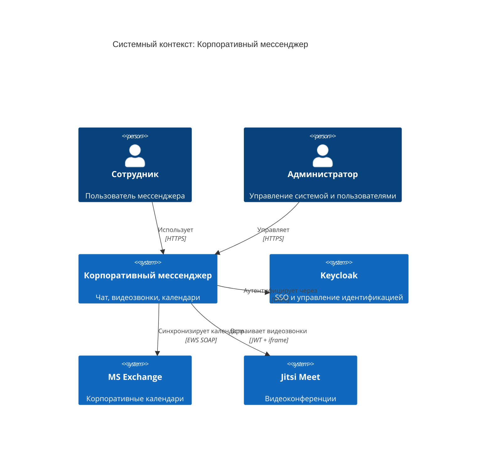
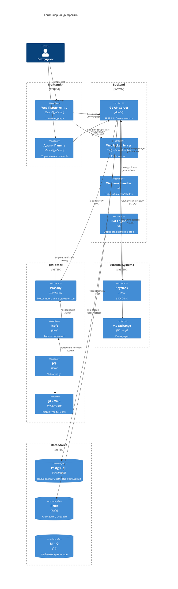
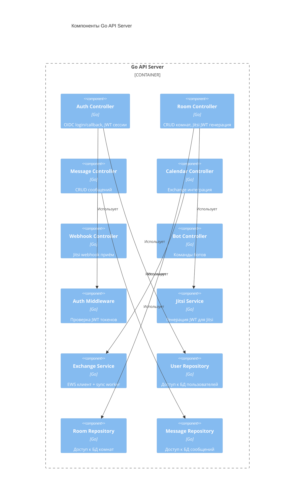
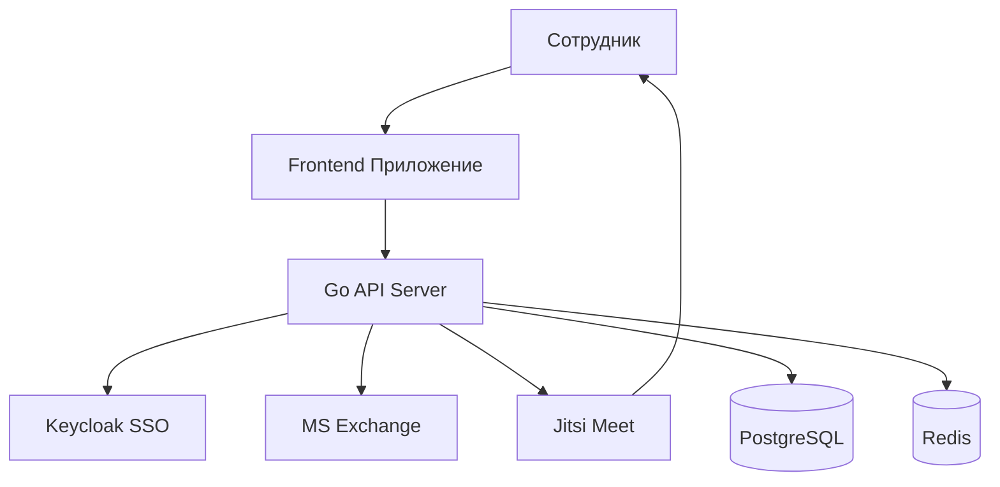
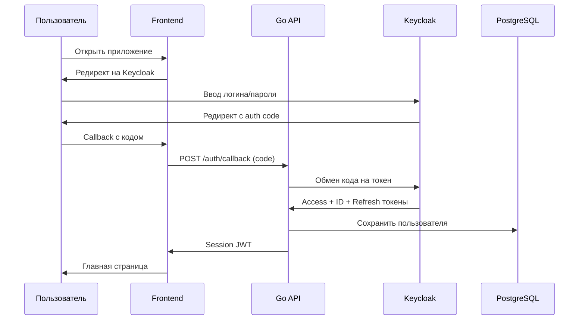
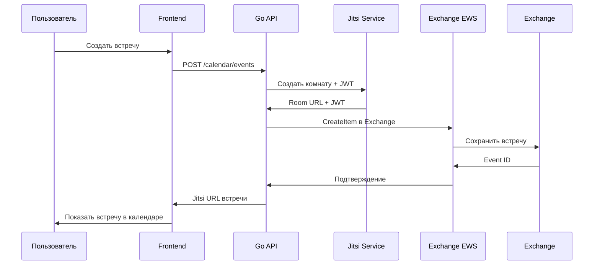

# Архитектура системы: Корпоративный мессенджер на базе Jitsi Meet

**Версия:** 1.0  
**Дата:** 24 марта 2026 г.  
**Статус:** Черновик

---

## 1. Обзор системы

Корпоративный мессенджер с видеоконференциями на базе Jitsi Meet, интегрированный с:
- **Keycloak** — единая система аутентификации (SSO)
- **MS Exchange** — корпоративные календари
- **Собственный бэкенд на Go** — бизнес-логика, API, вебхуки, боты

---

## 2. C4 Модель: Контекст



---

## 3. C4 Модель: Контейнеры



---

## 4. Компонентная диаграмма (Go Бэкенд)



---

## 5. Технологический стек

### 5.1. Бэкенд

| Компонент | Технология | Обоснование |
|-----------|------------|-------------|
| Язык | Go 1.21 | Высокая производительность, простота развёртывания |
| Фреймворк | Chi / Gin | Лёгкий, быстрый, middleware поддержка |
| ORM | GORM | Зрелая, поддержка PostgreSQL |
| БД | PostgreSQL 15 | Надёжность, JSONB, full-text search |
| Кэш | Redis 7 | Сессии, очереди, pub/sub |
| Хранилище | MinIO | S3-совместимое, on-premise |

### 5.2. Фронтенд

| Компонент | Технология | Обоснование |
|-----------|------------|-------------|
| Фреймворк | React 18 | Компонентный подход, экосистема |
| Язык | TypeScript 5 | Типобезопасность, DX |
| Стейт | Zustand | Простой, лёгкий, без boilerplate |
| Стили | Tailwind CSS | Утилитарный подход, скорость |
| Роутинг | React Router v6 | Стандарт де-факто |
| HTTP | Axios | Интерцепторы, удобство |

### 5.3. Инфраструктура

| Компонент | Технология | Обоснование |
|-----------|------------|-------------|
| Контейнеризация | Docker | Стандартизация окружений |
| Оркестрация | Kubernetes 1.27+ | Масштабирование, HA |
| Ingress | Nginx Ingress | Гибкость, TLS |
| Мониторинг | Prometheus + Grafana | Метрики, алерты, дашборды |
| Логи | Loki + Promtail | Лёгковесный, интеграция с Grafana |
| SSO | Keycloak 22+ | OIDC, LDAP интеграция |
| Видеоконференции | Jitsi Meet | Open source, self-hosted |

---

## 6. Архитектурные принципы

### 6.1. Общие принципы

- **RESTful API** — ресурсно-ориентированная архитектура
- **Stateless бэкенд** — сессии в Redis, горизонтальное масштабирование
- **Event-driven** — вебхуки для асинхронных событий
- **Security by design** — валидация входных данных, JWT, HTTPS
- **Observability** — логи, метрики, трейсинг

### 6.2. Паттерны

| Паттерн | Применение |
|---------|------------|
| API Gateway | Единая точка входа, rate limiting |
| Repository | Абстракция доступа к данным |
| Middleware | Cross-cutting concerns (auth, logging) |
| Factory | Генерация JWT, создание клиентов |
| Observer | Вебхуки, подписки на события |
| CQRS (частично) | Разделение чтения/записи для чата |

---

## 7. Диаграмма развёртывания (Kubernetes)

```mermaid
C4Deployment
    title Развёртывание в Kubernetes

    Deployment_Node(k8s_cluster, "Kubernetes Cluster", "AWS EKS / On-premise") {
        Deployment_Node(ns_messenger, "Namespace: messenger", "Pods") {
            Deployment_Node(api_pod, "API Pod", "2+ replicas") {
                Container(api_container, "Go API", "Go 1.21")
            }
            Deployment_Node(frontend_pod, "Frontend Pod", "2+ replicas") {
                Container(nginx_container, "Nginx", "Nginx Alpine")
            }
            Deployment_Node(websocket_pod, "WebSocket Pod", "2+ replicas") {
                Container(ws_container, "Go WebSocket", "Go 1.21")
            }
        }

        Deployment_Node(ns_jitsi, "Namespace: jitsi", "Pods") {
            Deployment_Node(prosody_pod, "Prosody Pod", "1 replica") {
                Container(prosody_container, "Prosody", "Debian")
            }
            Deployment_Node(jicofo_pod, "Jicofo Pod", "1 replica") {
                Container(jicofo_container, "Jicofo", "OpenJDK 17")
            }
            Deployment_Node(jvb_pod, "JVB Pods", "2+ replicas, HPA") {
                Container(jvb_container, "JVB", "OpenJDK 17")
            }
        }

        Deployment_Node(ns_infra, "Namespace: infrastructure", "Pods") {
            Deployment_Node(postgres_pod, "PostgreSQL Pod", "StatefulSet") {
                Container(postgres_container, "PostgreSQL", "PostgreSQL 15")
            }
            Deployment_Node(redis_pod, "Redis Pod", "StatefulSet") {
                Container(redis_container, "Redis", "Redis 7")
            }
            Deployment_Node(keycloak_pod, "Keycloak Pod", "2+ replicas") {
                Container(keycloak_container, "Keycloak", "OpenJDK 17")
            }
        }
    }

    Rel(api_container, postgres_container, "SQL", "5432")
    Rel(api_container, redis_container, "Redis Protocol", "6379")
    Rel(frontend_pod, api_container, "HTTPS", "8080")
    Rel(jicofo_container, prosody_container, "XMPP", "5347")
    Rel(jvb_container, jicofo_container, "Colibri", "8787")
```

---

## 8. Схема потоков данных (DFD Level 0)



---

## 9. Диаграмма последовательности: Аутентификация



---

## 10. Диаграмма последовательности: Создание встречи



---

## 11. Безопасность

### 11.1. Аутентификация и авторизация

- **OIDC Flow** — Authorization Code с PKCE
- **JWT сессии** — короткое время жизни (15 мин access, 7 дней refresh)
- **Jitsi JWT** — отдельный токен для каждой комнаты (8 часов)
- **Роли** — user, moderator, admin (маппинг из Keycloak)

### 11.2. Защита данных

- **TLS 1.3** — всё HTTPS/WSS
- **Шифрование БД** — TDE для PostgreSQL
- **Секреты** — Kubernetes Secrets / HashiCorp Vault
- **CORS** — строгие правила для фронтенда

### 11.3. Аудит

- Логирование всех auth событий
- Логирование создания/удаления комнат
- Логирование доступа к календарям

---

## 12. Масштабирование

### 12.1. Горизонтальное масштабирование

| Компонент | Стратегия |
|-----------|-----------|
| Go API | HPA по CPU/RPS, 2+ реплики |
| Frontend | HPA по CPU, CDN для статики |
| JVB | HPA по количеству участников |
| PostgreSQL | Read replicas, connection pooling |
| Redis | Cluster mode, sharding |

### 12.2. Вертикальное масштабирование

| Компонент | Минимум | Рекомендуется |
|-----------|---------|---------------|
| Go API Pod | 100m CPU, 128Mi RAM | 500m CPU, 512Mi RAM |
| JVB Pod | 1 CPU, 2Gi RAM | 4 CPU, 8Gi RAM |
| PostgreSQL | 2 CPU, 4Gi RAM | 8 CPU, 32Gi RAM |

---

## 13. Приложения

### 13.1. Глоссарий

См. [Glossary.md](./Glossary.md)

### 13.2. Ссылки

- [Jitsi Documentation](https://jitsi.github.io/handbook/)
- [Keycloak Documentation](https://www.keycloak.org/documentation)
- [Exchange Web Services](https://learn.microsoft.com/en-us/exchange/client-developer/exchange-web-services/start-using-web-services-in-exchange)
