# Data Flow Diagrams (DFD)

**Версия:** 1.0  
**Дата:** 24 марта 2026 г.  
**Статус:** Черновик

---

## 1. DFD Level 0 (Context Diagram)

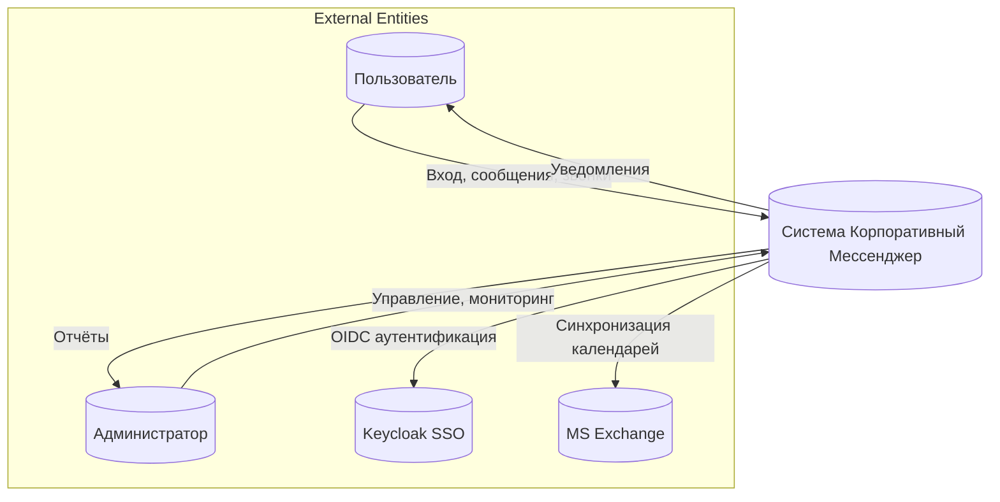

---

## 2. DFD Level 1: Основные процессы

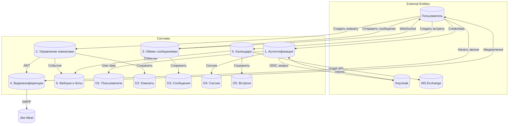

---

## 3. DFD Level 2: Аутентификация

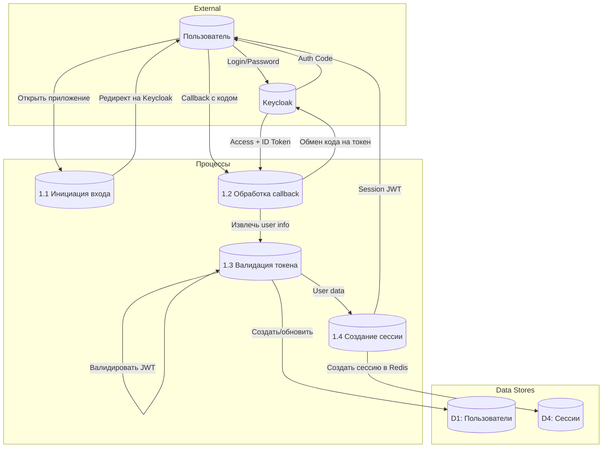

---

## 4. DFD Level 2: Управление комнатами

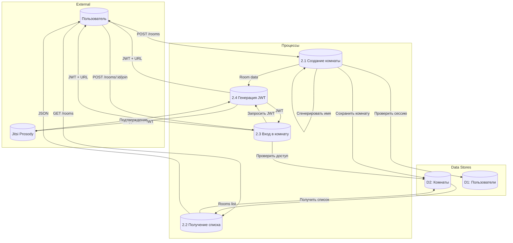

---

## 5. DFD Level 2: Обмен сообщениями

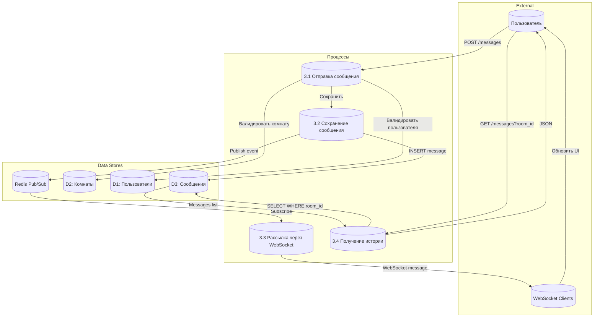

---

## 6. DFD Level 2: Видеоконференции

```mermaid
graph TB
    subgraph "External"
        User[("Пользователь")]
        JitsiMeet[("Jitsi Meet Web")]
        JVB[("Jitsi Videobridge")]
    end

    subgraph "Процессы"
        P4_1[("4.1 Инициация звонка")]
        P4_2[("4.2 Генерация JWT")]
        P4_3[("4.3 Подключение к комнате")]
        P4_4[("4.4 Мониторинг звонка")]
    end

    subgraph "Data Stores"
        D2[("D2: Комнаты")]
        Events[("D6: События звонков")]
    end

    User -->|Нажать "Начать звонок"| P4_1
    P4_1 -->|Получить комнату| D2
    P4_1 -->|Запросить JWT| P4_2
    P4_2 -->|Создать JWT claims| P4_2
    P4_2 -->|Подписать секретом| P4_2
    P4_2 -->|JWT| P4_1
    P4_1 -->|Открыть iframe с JWT| JitsiMeet
    JitsiMeet -->|XMPP authenticate| Prosody[("Prosody")]
    Prosody -->|Валидировать JWT| Prosody
    Prosody -->|Разрешить вход| JitsiMeet
    JitsiMeet -->|WebRTC stream| JVB
    JVB -->|Video to participants| User
    P4_4 -->|Получать события| Prosody
    P4_4 -->|Сохранить| Events
```

---

## 7. DFD Level 2: Календари

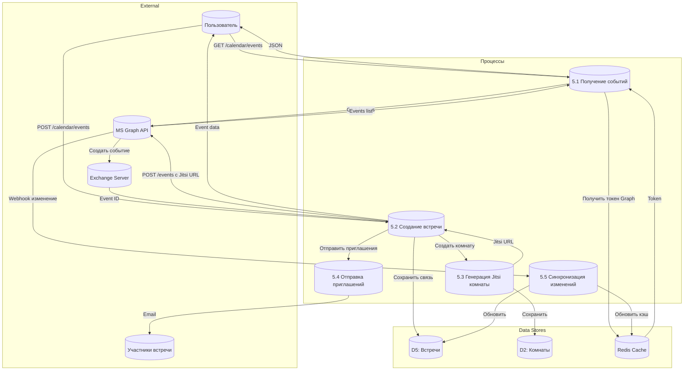

---

## 8. DFD Level 2: Вебхуки и боты

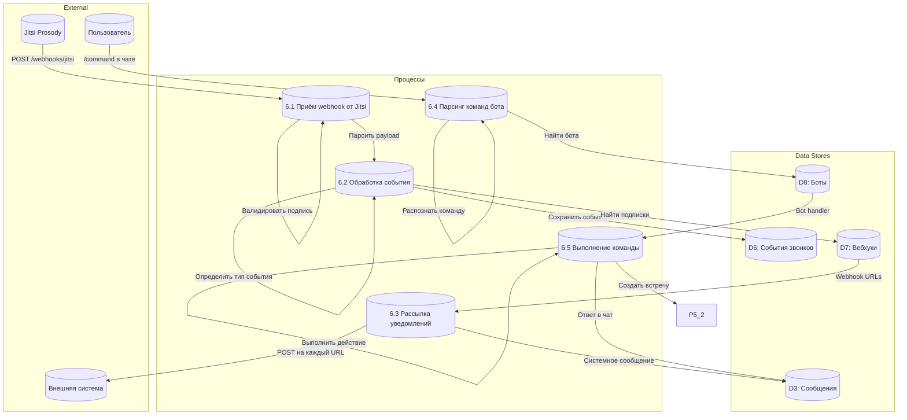

---

## 9. Схема аутентификации JWT

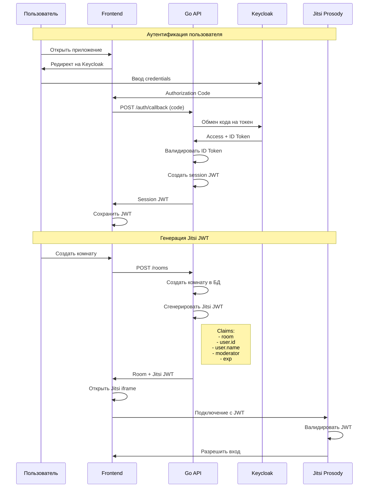

---

## 10. Поток данных: Создание встречи

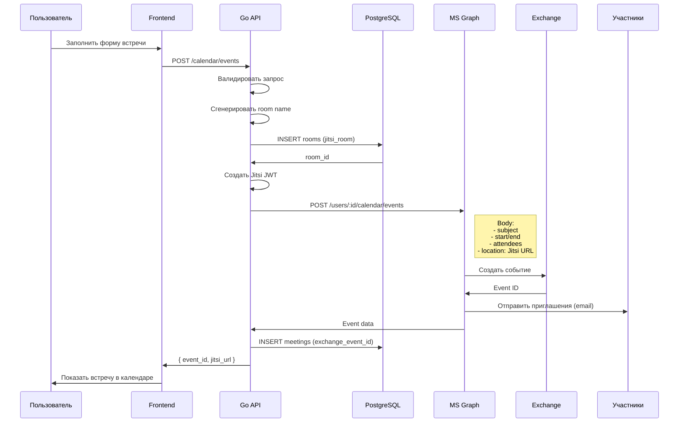

---

## 11. Поток данных: Real-time чат

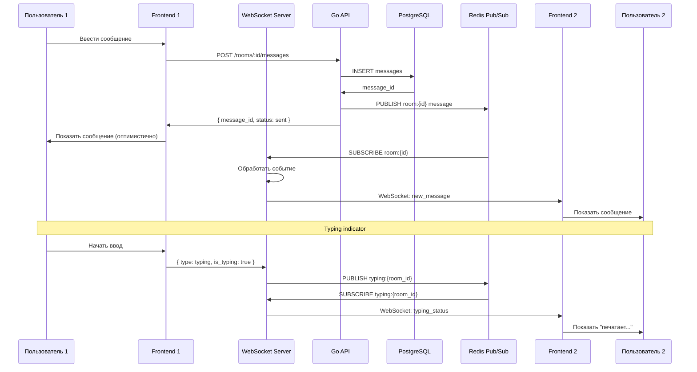

---

## 12. Таблица потоков данных

| ID | Источник | Назначение | Данные | Протокол | Частота |
|----|----------|------------|--------|----------|---------|
| F1 | Пользователь | Frontend | Credentials | HTTPS | По запросу |
| F2 | Frontend | Keycloak | Auth request | HTTPS (OIDC) | По запросу |
| F3 | Keycloak | Frontend | Auth code | HTTPS | По запросу |
| F4 | Frontend | Go API | Code exchange | HTTPS | По запросу |
| F5 | Go API | Keycloak | Token request | HTTPS | По запросу |
| F6 | Keycloak | Go API | Access/ID tokens | HTTPS | По запросу |
| F7 | Go API | PostgreSQL | User data | SQL (5432) | По запросу |
| F8 | Go API | Redis | Session data | Redis (6379) | По запросу |
| F9 | Frontend | Go API | REST API calls | HTTPS | По запросу |
| F10 | Frontend | WebSocket | Real-time messages | WSS | Постоянно |
| F11 | Go API | PostgreSQL | Messages CRUD | SQL | По запросу |
| F12 | Go API | Redis | Pub/Sub events | Redis | Real-time |
| F13 | WebSocket | Frontend | Push notifications | WSS | Real-time |
| F14 | Frontend | Jitsi iframe | Video conference | HTTPS | По запросу |
| F15 | Go API | Jitsi Prosody | JWT generation | JWT | По запросу |
| F16 | Jitsi Prosody | Go API | Webhook events | HTTPS | По событию |
| F17 | Go API | MS Graph | Calendar API | HTTPS | По запросу |
| F18 | MS Graph | Go API | Events data | HTTPS | По запросу |
| F19 | Go API | External | Outgoing webhooks | HTTPS | По событию |

---

## 13. Диаграмма состояний: Комната

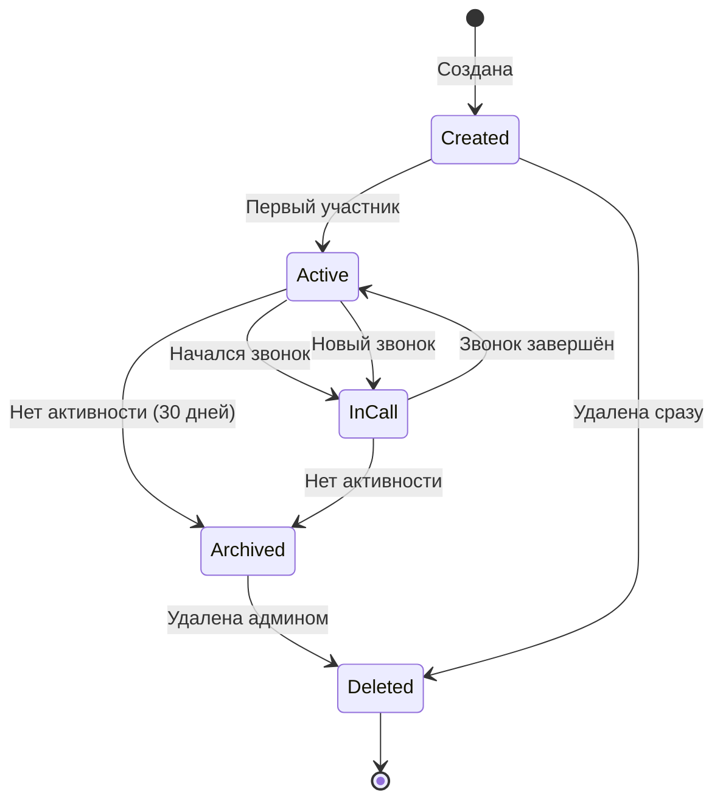

---

## 14. Диаграмма состояний: Встреча

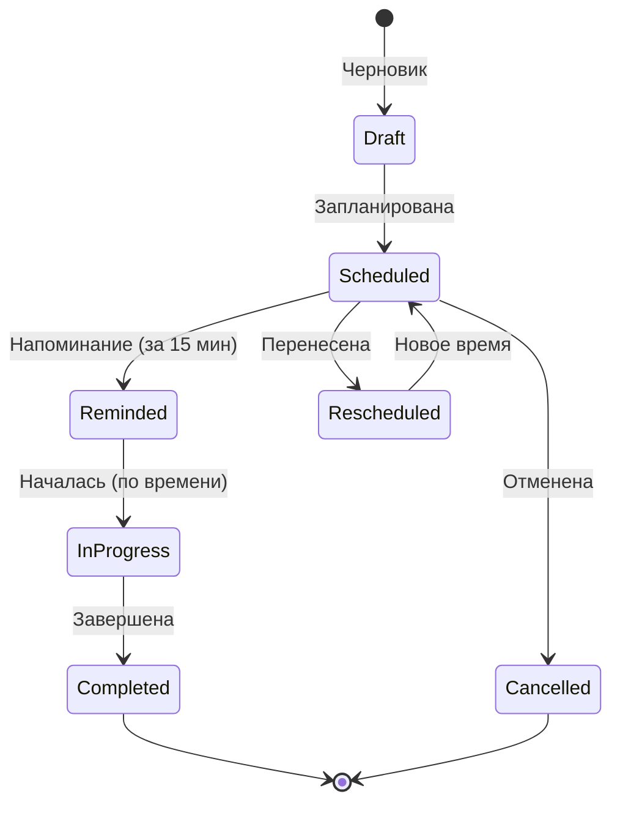

---

## 15. Приложения

### 15.1. Глоссарий DFD

| Термин | Определение |
|--------|-------------|
| External Entity | Внешняя система или пользователь |
| Process | Обработка данных внутри системы |
| Data Store | Хранилище данных (БД, кэш) |
| Data Flow | Поток данных между компонентами |

### 15.2. Ссылки

- [Architecture.md](./Architecture.md)
- [HLD.md](./HLD.md)
- [LLD.md](./LLD.md)
