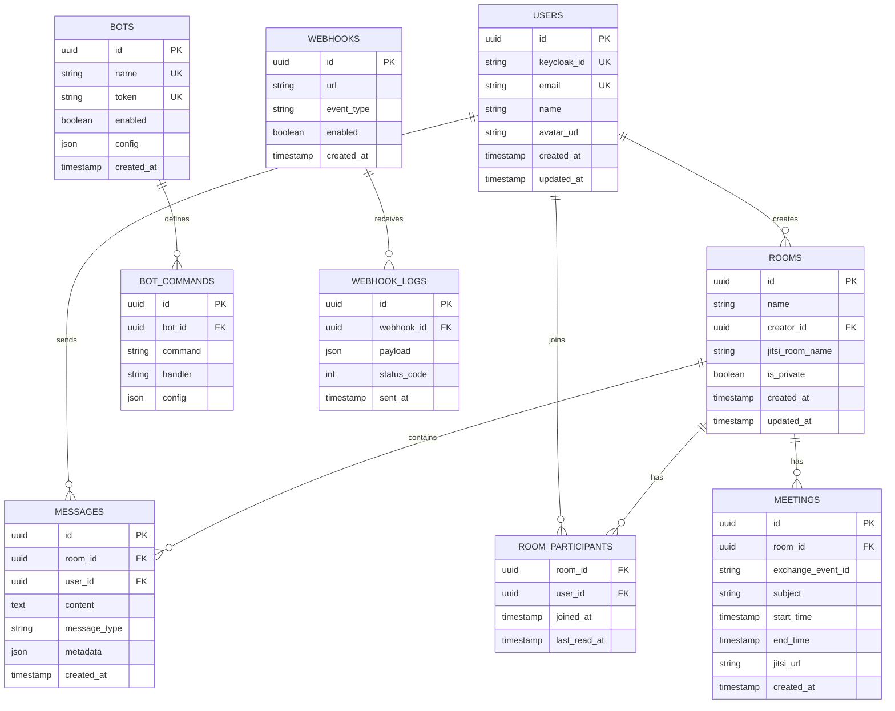

# High-Level Design (HLD)

**Версия:** 1.0  
**Дата:** 24 марта 2026 г.  
**Статус:** Черновик

---

## 1. Введение

### 1.1. Назначение документа

Этот документ описывает высокоуровневое проектирование системы корпоративного мессенджера. Документ предназначен для:
- Архитекторов системы
- Тимлидов разработки
- DevOps инженеров
- Заинтересованных сторон

### 1.2. Область применения

Система предоставляет:
- Текстовый чат (one-to-one и групповой)
- Видеоконференции (до 100+ участников)
- Интеграцию с календарями MS Exchange
- Единый вход через корпоративный SSO (Keycloak)
- Чат-боты для автоматизации
- Вебхуки для интеграции с внешними системами

### 1.3. Определения и сокращения

| Термин | Определение |
|--------|-------------|
| SSO | Single Sign-On — единый вход |
| OIDC | OpenID Connect — протокол аутентификации |
| JWT | JSON Web Token — формат токенов |
| XMPP | Extensible Messaging and Presence Protocol |
| MUC | Multi-User Chat — групповой чат |
| JVB | Jitsi Videobridge |
| HPA | Horizontal Pod Autoscaler |
| RPS | Requests Per Second |

---

## 2. Архитектурные решения

### 2.1. Выбор архитектуры

**Решение:** Модульная монолитная архитектура для бэкенда + микросервисы для Jitsi

**Обоснование:**
- Команда 3–5 разработчиков
- Быстрый старт и простота развёртывания
- Jitsi — отдельный стек, целесообразно изолировать
- Возможность выделения сервисов в будущем (auth, calendar, bots)

### 2.2. Выбор технологий

#### Бэкенд: Go

**Решение:** Go 1.21+

**Обоснование:**
- Высокая производительность (компилируемый язык)
- Встроенная поддержка конкурентности (горутины)
- Простое развёртывание (один бинарник)
- Отличная поддержка WebSocket
- Зрелая экосистема для API

#### Фронтенд: React + TypeScript

**Решение:** React 18 + TypeScript 5 + Vite

**Обоснование:**
- Большая экосистема библиотек
- Типобезопасность для сложной бизнес-логики
- Хорошая поддержка Jitsi iframe API
- Легко найти разработчиков

#### База данных: PostgreSQL

**Решение:** PostgreSQL 15+

**Обоснование:**
- Надёжность и ACID-транзакции
- JSONB для гибких схем
- Full-text search для сообщений
- Зрелые инструменты миграции

#### Кэш: Redis

**Решение:** Redis 7+

**Обоснование:**
- Сессии пользователей
- Pub/sub для real-time событий
- Очереди для ботов и вебхуков
- Персистентность (RDB + AOF)

---

## 3. Структура системы

### 3.1. Компоненты системы

```
┌─────────────────────────────────────────────────────────────────┐
│                         Frontend Layer                          │
├─────────────────────────┬───────────────────────────────────────┤
│   Web App (React)       │    Admin Panel (React)                │
│   - Чат                 │    - Управление пользователями        │
│   - Видеозвонки         │    - Мониторинг                       │
│   - Календарь           │    - Логи и аудит                     │
└──────────┬──────────────┴────────────────┬──────────────────────┘
           │                               │
           │ HTTPS/WSS                     │ HTTPS
           ▼                               ▼
┌─────────────────────────────────────────────────────────────────┐
│                         API Gateway Layer                       │
├─────────────────────────────────────────────────────────────────┤
│                    Nginx Ingress / Traefik                      │
│   - TLS termination     - Rate limiting     - CORS             │
└──────────┬────────────────────────────────────┬─────────────────┘
           │                                    │
           ▼                                    ▼
┌─────────────────────────────────────────────────────────────────┐
│                      Application Layer                          │
├─────────────────────────┬───────────────────────────────────────┤
│   Go API Server         │    WebSocket Server                   │
│   - REST API            │    - Real-time сообщения              │
│   - Auth (OIDC)         │    - Присутствие                      │
│   - Rooms CRUD          │    - Typing indicators                │
│   - Calendar (Graph)    │    - Уведомления                      │
│   - Webhooks            │                                       │
│   - Bots                │                                       │
└──────────┬──────────────┴────────────────┬──────────────────────┘
           │                               │
           │                               │ Internal API
           │                               ▼
           │                    ┌──────────────────────┐
           │                    │  Webhook Handler     │
           │                    │  Bot Engine          │
           │                    └──────────┬───────────┘
           │                               │
           ▼                               ▼
┌─────────────────────────────────────────────────────────────────┐
│                        Data Layer                               │
├─────────────────┬───────────────────┬───────────────────────────┤
│   PostgreSQL    │    Redis          │    MinIO (S3)             │
│   - Users       │    - Sessions     │    - Аватарки             │
│   - Rooms       │    - Cache        │    - Файлы                │
│   - Messages    │    - Pub/Sub      │    - Записи звонков       │
│   - Bots        │    - Queues       │                           │
└─────────────────┴───────────────────┴───────────────────────────┘
           │
           ▼
┌─────────────────────────────────────────────────────────────────┐
│                   External Services Layer                       │
├─────────────────────┬─────────────────────┬─────────────────────┤
│   Keycloak (SSO)    │   MS Exchange       │   Jitsi Meet        │
│   - OIDC            │   - Graph API       │   - Prosody (XMPP)  │
│   - Users/Groups    │   - Calendar        │   - Jicofo          │
│                     │   - Mail            │   - JVB             │
└─────────────────────┴─────────────────────┴─────────────────────┘
```

### 3.2. Модули Go-бэкенда

```
API_Go/
├── cmd/
│   └── server/
│       └── main.go              # Точка входа
├── internal/
│   ├── auth/
│   │   ├── keycloak.go          # OIDC клиент
│   │   ├── jwt.go               # Генерация JWT
│   │   ├── middleware.go        # Auth middleware
│   │   └── session.go           # Управление сессиями
│   ├── api/
│   │   ├── handlers/
│   │   │   ├── auth.go          # Login/callback
│   │   │   ├── rooms.go         # Rooms CRUD
│   │   │   ├── messages.go      # Messages CRUD
│   │   │   └── calendar.go      # Exchange integration
│   │   └── routes.go            # Роутинг
│   ├── calendar/
│   │   ├── graph.go             # MS Graph клиент
│   │   ├── events.go            # Логика событий
│   │   └── sync.go              # Синхронизация
│   ├── webhooks/
│   │   ├── handler.go           # Обработка webhook
│   │   ├── jitsi.go             # Jitsi события
│   │   └── dispatcher.go        # Рассылка событий
│   ├── bots/
│   │   ├── engine.go            # Бот-движок
│   │   ├── commands.go          # Парсинг команд
│   │   └── builtin/
│   │       ├── meeting.go       # Meeting bot
│   │       └── help.go          # Help bot
│   ├── websocket/
│   │   ├── hub.go               # WebSocket hub
│   │   ├── client.go            # Клиентское соединение
│   │   └── messages.go          # WS сообщения
│   ├── models/
│   │   ├── user.go              # User модель
│   │   ├── room.go              # Room модель
│   │   ├── message.go           # Message модель
│   │   └── bot.go               # Bot модель
│   ├── repository/
│   │   ├── user_repo.go         # User repository
│   │   ├── room_repo.go         # Room repository
│   │   └── message_repo.go      # Message repository
│   └── config/
│       └── config.go            # Конфигурация
├── pkg/
│   ├── jitsi/
│   │   └── jwt.go               # Jitsi JWT генерация
│   ├── exchange/
│   │   └── client.go            # Exchange клиент
│   └── logger/
│       └── logger.go            # Логирование
├── migrations/
│   ├── 001_create_users.sql
│   ├── 002_create_rooms.sql
│   └── 003_create_messages.sql
├── Dockerfile
├── go.mod
└── go.sum
```

---

## 4. Взаимодействие компонентов

### 4.1. Сценарий: Вход пользователя

```
1. Пользователь открывает веб-приложение
2. Frontend проверяет наличие токена
3. Если токена нет → редирект на Keycloak
4. Пользователь вводит credentials в Keycloak
5. Keycloak редиректит обратно с authorization code
6. Frontend отправляет code на Go API (/auth/callback)
7. Go API обменивает code на токены (access, id, refresh)
8. Go API извлекает user info из ID токена
9. Go API создаёт/обновляет пользователя в БД
10. Go API генерирует session JWT для фронтенда
11. Frontend сохраняет JWT и использует для API запросов
```

### 4.2. Сценарий: Создание комнаты

```
1. Пользователь нажимает "Создать комнату"
2. Frontend отправляет POST /api/v1/rooms
3. Go API проверяет JWT сессию
4. Go API генерирует уникальное имя комнаты
5. Go API создаёт запись в БД (rooms таблица)
6. Go API генерирует Jitsi JWT с claims:
   - room: имя комнаты
   - user: id, name, email, moderator
   - exp: 8 часов
7. Go API возвращает { room_id, jitsi_url, jwt }
8. Frontend открывает Jitsi iframe с JWT
```

### 4.3. Сценарий: Отправка сообщения

```
1. Пользователь вводит сообщение в чат
2. Frontend отправляет POST /api/v1/rooms/:id/messages
3. Go API проверяет JWT, валидирует комнату
4. Go API сохраняет сообщение в БД
5. Go API публикует событие в Redis Pub/Sub
6. WebSocket Hub подписан на Pub/Sub
7. WebSocket Hub рассылает сообщение клиентам в комнате
8. Frontend получает сообщение через WebSocket
9. Frontend обновляет UI (оптимистично или после подтверждения)
```

### 4.4. Сценарий: Создание встречи в календаре

```
1. Пользователь заполняет форму создания встречи
2. Frontend отправляет POST /api/v1/calendar/events
3. Go API проверяет JWT сессию
4. Go API создаёт комнату Jitsi (см. сценарий 4.2)
5. Go API получает токен Graph API (on-behalf-of)
6. Go API создаёт событие в Exchange:
   - subject, start, end, attendees
   - location: Jitsi URL
7. Graph API отправляет приглашения attendees
8. Go API возвращает { event_id, jitsi_url }
9. Frontend отображает встречу в календаре
```

---

## 5. Схема базы данных

### 5.1. ER-диаграмма



### 5.2. Индексы

```sql
-- Users
CREATE INDEX idx_users_keycloak_id ON users(keycloak_id);
CREATE INDEX idx_users_email ON users(email);

-- Rooms
CREATE INDEX idx_rooms_creator_id ON rooms(creator_id);
CREATE INDEX idx_rooms_jitsi_room ON rooms(jitsi_room_name);

-- Messages
CREATE INDEX idx_messages_room_id ON messages(room_id);
CREATE INDEX idx_messages_user_id ON messages(user_id);
CREATE INDEX idx_messages_created_at ON messages(created_at);
CREATE INDEX idx_messages_room_created ON messages(room_id, created_at);

-- Room Participants
CREATE INDEX idx_room_participants_room ON room_participants(room_id);
CREATE INDEX idx_room_participants_user ON room_participants(user_id);

-- Meetings
CREATE INDEX idx_meetings_room_id ON meetings(room_id);
CREATE INDEX idx_meetings_exchange_id ON meetings(exchange_event_id);
CREATE INDEX idx_meetings_start_time ON meetings(start_time);

-- Bots
CREATE INDEX idx_bots_enabled ON bots(enabled);

-- Webhooks
CREATE INDEX idx_webhooks_enabled ON webhooks(enabled);
CREATE INDEX idx_webhook_logs_webhook_id ON webhook_logs(webhook_id);
```

---

## 6. API спецификация (обзор)

### 6.1. Authentication

| Endpoint | Method | Описание |
|----------|--------|----------|
| `/api/v1/auth/login` | GET | Редирект на Keycloak |
| `/api/v1/auth/callback` | GET | Обмен кода на токен |
| `/api/v1/auth/refresh` | POST | Refresh токена |
| `/api/v1/auth/logout` | POST | Logout, invalidation |

### 6.2. Rooms

| Endpoint | Method | Описание |
|----------|--------|----------|
| `/api/v1/rooms` | GET | Список комнат |
| `/api/v1/rooms` | POST | Создать комнату |
| `/api/v1/rooms/:id` | GET | Детали комнаты |
| `/api/v1/rooms/:id` | PUT | Обновить комнату |
| `/api/v1/rooms/:id` | DELETE | Удалить комнату |
| `/api/v1/rooms/:id/join` | POST | Присоединиться (генерация JWT) |

### 6.3. Messages

| Endpoint | Method | Описание |
|----------|--------|----------|
| `/api/v1/rooms/:id/messages` | GET | История сообщений |
| `/api/v1/rooms/:id/messages` | POST | Отправить сообщение |
| `/api/v1/messages/:id` | PUT | Обновить сообщение |
| `/api/v1/messages/:id` | DELETE | Удалить сообщение |

### 6.4. Calendar

| Endpoint | Method | Описание |
|----------|--------|----------|
| `/api/v1/calendar/events` | GET | Список событий |
| `/api/v1/calendar/events` | POST | Создать встречу |
| `/api/v1/calendar/events/:id` | PUT | Обновить событие |
| `/api/v1/calendar/events/:id` | DELETE | Отменить встречу |

### 6.5. Webhooks

| Endpoint | Method | Описание |
|----------|--------|----------|
| `/api/v1/webhooks/jitsi` | POST | Входящий webhook от Jitsi |
| `/api/v1/webhooks` | GET | Список webhook |
| `/api/v1/webhooks` | POST | Создать webhook |
| `/api/v1/webhooks/:id` | DELETE | Удалить webhook |

### 6.6. Bots

| Endpoint | Method | Описание |
|----------|--------|----------|
| `/api/v1/bots` | GET | Список ботов |
| `/api/v1/bots` | POST | Создать бота |
| `/api/v1/bots/:id/commands` | GET | Команды бота |
| `/api/v1/bots/command` | POST | Выполнить команду |

---

## 7. WebSocket протокол

### 7.1. Подключение

```
wss://api.company.com/ws
Authorization: Bearer <JWT>
```

### 7.2. Сообщения (Client → Server)

```json
{
  "type": "subscribe",
  "payload": {
    "room_id": "uuid"
  }
}
```

```json
{
  "type": "message",
  "payload": {
    "room_id": "uuid",
    "content": "текст",
    "type": "text|image|file"
  }
}
```

```json
{
  "type": "typing",
  "payload": {
    "room_id": "uuid",
    "is_typing": true
  }
}
```

### 7.3. Сообщения (Server → Client)

```json
{
  "type": "message",
  "payload": {
    "id": "uuid",
    "room_id": "uuid",
    "user_id": "uuid",
    "content": "текст",
    "type": "text",
    "created_at": "2024-01-01T12:00:00Z"
  }
}
```

```json
{
  "type": "user_joined",
  "payload": {
    "room_id": "uuid",
    "user_id": "uuid",
    "user_name": "Имя"
  }
}
```

```json
{
  "type": "typing",
  "payload": {
    "room_id": "uuid",
    "user_id": "uuid",
    "is_typing": true
  }
}
```

---

## 8. Интеграции

### 8.1. Keycloak (OIDC)

**Flow:** Authorization Code с PKCE

**Scopes:**
- `openid` — обязательный
- `profile` — информация о пользователе
- `email` — email
- `roles` — роли пользователя

**Claims mapping:**
```json
{
  "sub": "keycloak_user_id",
  "email": "email",
  "name": "full_name",
  "realm_access": {
    "roles": ["user", "moderator", "admin"]
  }
}
```

### 8.2. MS Exchange (Graph API)

**Permissions:**
- `Calendars.ReadWrite` — доступ к календарям
- `Mail.Send` — отправка приглашений
- `User.Read` — чтение профиля

**Flow:** OAuth 2.0 On-Behalf-Of (OBO)

### 8.3. Jitsi Meet

**Аутентификация:** JWT

**Claims:**
```json
{
  "iss": "jitsi",
  "aud": "jitsi",
  "exp": 1709312400,
  "room": "room_name",
  "context": {
    "user": {
      "id": "user_id",
      "name": "User Name",
      "email": "user@email.com",
      "moderator": true
    }
  }
}
```

---

## 9. Развёртывание

### 9.1. Окружения

| Окружение | Назначение | Доступ |
|-----------|------------|--------|
| `local` | Локальная разработка | Docker Compose |
| `dev` | Разработка, тесты | Kubernetes, внутренний |
| `staging` | Предпродакшн | Kubernetes, внешний (тестовый) |
| `prod` | Продакшн | Kubernetes, внешний (боевой) |

### 9.2. Kubernetes ресурсы

**Namespaces:**
- `messenger` — приложение (API, frontend, WebSocket)
- `jitsi` — Jitsi стек
- `infra` — инфраструктура (PostgreSQL, Redis, Keycloak)

**Resource Quotas:**
```yaml
apiVersion: v1
kind: ResourceQuota
metadata:
  name: messenger-quota
  namespace: messenger
spec:
  hard:
    requests.cpu: "4"
    requests.memory: 8Gi
    limits.cpu: "8"
    limits.memory: 16Gi
    pods: "20"
```

### 9.3. HPA конфигурация

```yaml
apiVersion: autoscaling/v2
kind: HorizontalPodAutoscaler
metadata:
  name: api-go-hpa
  namespace: messenger
spec:
  scaleTargetRef:
    apiVersion: apps/v1
    kind: Deployment
    name: api-go
  minReplicas: 2
  maxReplicas: 10
  metrics:
  - type: Resource
    resource:
      name: cpu
      target:
        type: Utilization
        averageUtilization: 70
  - type: Resource
    resource:
      name: memory
      target:
        type: Utilization
        averageUtilization: 80
```

---

## 10. Мониторинг и observability

### 10.1. Метрики (Prometheus)

**Go API:**
- `http_requests_total` — количество запросов
- `http_request_duration_seconds` — длительность запросов
- `active_sessions` — активные сессии
- `websocket_connections` — WebSocket подключения

**Jitsi:**
- `jitsi_participants` — участники конференций
- `jitsi_conferences` — активные конференции
- `jitsi_bitrate` — битрейт видео
- `jitsi_cpu_usage` — использование CPU

### 10.2. Логи (Loki)

**Уровни логирования:**
- `DEBUG` — отладка (только dev)
- `INFO` — информация (dev, staging)
- `WARN` — предупреждения
- `ERROR` — ошибки

**Структура лога:**
```json
{
  "level": "info",
  "timestamp": "2024-01-01T12:00:00Z",
  "service": "api-go",
  "trace_id": "abc123",
  "user_id": "uuid",
  "message": "User logged in",
  "context": {
    "email": "user@company.com"
  }
}
```

### 10.3. Трейсинг (опционально)

**Инструмент:** Jaeger / Tempo

**Интеграция:** OpenTelemetry

---

## 11. Безопасность

### 11.1. Threat Model

**Активы:**
- Пользовательские данные (email, имя)
- Сообщения чата
- Записи видеоконференций
- JWT токены

**Угрозы:**
- Перехват токенов (MitM)
- SQL injection
- XSS атаки
- DDoS атаки

**Меры защиты:**
- TLS 1.3 для всего трафика
- Prepared statements (GORM)
- CSP заголовки, санитизация ввода
- Rate limiting, WAF

### 11.2. Security Headers

```
Strict-Transport-Security: max-age=31536000; includeSubDomains
Content-Security-Policy: default-src 'self'; script-src 'self' meet.company.com
X-Content-Type-Options: nosniff
X-Frame-Options: SAMEORIGIN
X-XSS-Protection: 1; mode=block
```

---

## 12. Приложения

### 12.1. Ссылки

- [Low-Level Design](./LLD.md)
- [Infrastructure](./Infrastructure.md)
- [API Specification](./API.md)

### 12.2. История изменений

| Версия | Дата | Изменения |
|--------|------|-----------|
| 1.0 | 24.03.2026 | Initial draft |
