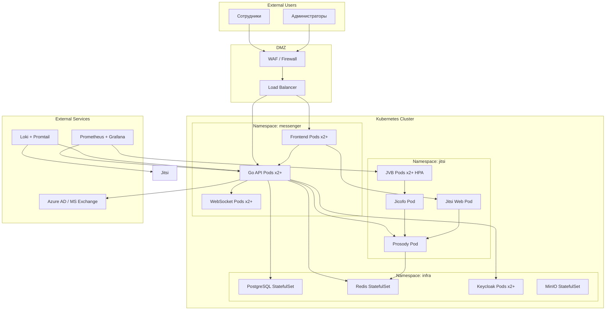

# Infrastructure Guide

**Версия:** 1.0  
**Дата:** 24 марта 2026 г.  
**Статус:** Черновик

---

## 1. Обзор инфраструктуры

### 1.1. Диаграмма развёртывания



---

## 2. Требования к инфраструктуре

### 2.1. Минимальные требования (Dev/Staging)

| Компонент | CPU | RAM | Disk | Количество |
|-----------|-----|-----|------|------------|
| Worker Nodes | 4 vCPU | 8 Gi | 100 Gi | 3 |
| PostgreSQL | 1 vCPU | 2 Gi | 20 Gi | 1 |
| Redis | 0.5 vCPU | 1 Gi | 5 Gi | 1 |
| Keycloak | 1 vCPU | 2 Gi | 10 Gi | 1 |
| Go API | 0.5 vCPU | 512 Mi | - | 2 |
| Frontend | 0.25 vCPU | 256 Mi | - | 2 |
| Jitsi (полный стек) | 4 vCPU | 8 Gi | 20 Gi | 1 |

**Итого минимум:** 3 ноды по 4 vCPU / 16 Gi

### 2.2. Production требования (100+ пользователей)

| Компонент | CPU | RAM | Disk | Количество |
|-----------|-----|-----|------|------------|
| Worker Nodes | 8 vCPU | 32 Gi | 500 Gi | 5 |
| PostgreSQL | 4 vCPU | 16 Gi | 500 Gi (SSD) | 1 + 1 replica |
| Redis | 2 vCPU | 8 Gi | 20 Gi | 3 (cluster) |
| Keycloak | 2 vCPU | 4 Gi | 20 Gi | 2 |
| Go API | 1 vCPU | 1 Gi | - | 3+ (HPA) |
| Frontend | 0.5 vCPU | 512 Mi | - | 3+ (HPA) |
| Jitsi JVB | 4 vCPU | 8 Gi | - | 3+ (HPA) |
| MinIO | 2 vCPU | 8 Gi | 1 Ti | 4 (distributed) |

**Итого Production:** 5 нод по 16 vCPU / 64 Gi

---

## 3. Kubernetes развёртывание

### 3.1. Подготовка кластера

**Требуемая версия:** Kubernetes 1.27+

**Необходимые компоненты:**
- `nginx-ingress` или `traefik` — Ingress controller
- `cert-manager` — автоматические TLS сертификаты
- `metrics-server` — метрики для HPA
- `external-dns` (опционально) — DNS автоматизация

### 3.2. Namespaces

```bash
kubectl create namespace messenger
kubectl create namespace jitsi
kubectl create namespace infra
kubectl create namespace monitoring
```

### 3.3. Storage Classes

```yaml
apiVersion: storage.k8s.io/v1
kind: StorageClass
metadata:
  name: standard-ssd
provisioner: kubernetes.io/aws-ebs  # или другой CSI
parameters:
  type: gp3
  fsType: ext4
reclaimPolicy: Retain
allowVolumeExpansion: true
```

### 3.4. Secrets

```bash
# PostgreSQL
kubectl create secret generic postgres-secret \
  --from-literal=postgres-password=$(openssl rand -base64 32) \
  --namespace infra

# Redis
kubectl create secret generic redis-secret \
  --from-literal=password=$(openssl rand -base64 32) \
  --namespace infra

# Keycloak
kubectl create secret generic keycloak-admin-secret \
  --from-literal=admin-password=$(openssl rand -base64 32) \
  --namespace infra

# Jitsi JWT Secret
kubectl create secret generic jitsi-jwt-secret \
  --from-literal=secret=$(openssl rand -base64 32) \
  --namespace jitsi

# Go API
kubectl create secret generic api-secrets \
  --from-literal=keycloak-client-secret=xxx \
  --from-literal=exchange-client-secret=xxx \
  --from-literal=jwt-secret=$(openssl rand -base64 32) \
  --namespace messenger

# TLS Certificates (cert-manager создаст автоматически)
```

---

## 4. Развёртывание PostgreSQL

### 4.1. StatefulSet

```yaml
apiVersion: apps/v1
kind: StatefulSet
metadata:
  name: postgresql
  namespace: infra
spec:
  serviceName: postgresql
  replicas: 1
  selector:
    matchLabels:
      app: postgresql
  template:
    metadata:
      labels:
        app: postgresql
    spec:
      containers:
      - name: postgresql
        image: postgres:15.4-alpine
        ports:
        - containerPort: 5432
        env:
        - name: POSTGRES_DB
          value: messenger
        - name: POSTGRES_USER
          value: messenger
        - name: POSTGRES_PASSWORD
          valueFrom:
            secretKeyRef:
              name: postgres-secret
              key: postgres-password
        volumeMounts:
        - name: postgres-data
          mountPath: /var/lib/postgresql/data
        resources:
          requests:
            cpu: 1
            memory: 2Gi
          limits:
            cpu: 2
            memory: 4Gi
        livenessProbe:
          exec:
            command:
            - pg_isready
            - -U
            - messenger
          initialDelaySeconds: 30
          periodSeconds: 10
        readinessProbe:
          exec:
            command:
            - pg_isready
            - -U
            - messenger
          initialDelaySeconds: 5
          periodSeconds: 5
  volumeClaimTemplates:
  - metadata:
      name: postgres-data
    spec:
      accessModes: ["ReadWriteOnce"]
      storageClassName: standard-ssd
      resources:
        requests:
          storage: 50Gi
```

### 4.2. Service

```yaml
apiVersion: v1
kind: Service
metadata:
  name: postgresql
  namespace: infra
spec:
  selector:
    app: postgresql
  ports:
  - port: 5432
    targetPort: 5432
  type: ClusterIP
```

---

## 5. Развёртывание Redis

### 5.1. StatefulSet (standalone для начала)

```yaml
apiVersion: apps/v1
kind: StatefulSet
metadata:
  name: redis
  namespace: infra
spec:
  serviceName: redis
  replicas: 1
  selector:
    matchLabels:
      app: redis
  template:
    metadata:
      labels:
        app: redis
    spec:
      containers:
      - name: redis
        image: redis:7.2-alpine
        command:
        - redis-server
        - --requirepass
        - $(REDIS_PASSWORD)
        - --appendonly
        - "yes"
        ports:
        - containerPort: 6379
        env:
        - name: REDIS_PASSWORD
          valueFrom:
            secretKeyRef:
              name: redis-secret
              key: password
        volumeMounts:
        - name: redis-data
          mountPath: /data
        resources:
          requests:
            cpu: 500m
            memory: 1Gi
          limits:
            cpu: 1
            memory: 2Gi
  volumeClaimTemplates:
  - metadata:
      name: redis-data
    spec:
      accessModes: ["ReadWriteOnce"]
      storageClassName: standard-ssd
      resources:
        requests:
          storage: 10Gi
```

---

## 6. Развёртывание Keycloak

### 6.1. Deployment

```yaml
apiVersion: apps/v1
kind: Deployment
metadata:
  name: keycloak
  namespace: infra
spec:
  replicas: 2
  selector:
    matchLabels:
      app: keycloak
  template:
    metadata:
      labels:
        app: keycloak
    spec:
      containers:
      - name: keycloak
        image: quay.io/keycloak/keycloak:22.0.5
        command:
        - /opt/keycloak/bin/kc.sh
        - start
        - --optimized
        env:
        - name: KEYCLOAK_ADMIN
          value: admin
        - name: KEYCLOAK_ADMIN_PASSWORD
          valueFrom:
            secretKeyRef:
              name: keycloak-admin-secret
              key: admin-password
        - name: KC_DB
          value: postgres
        - name: KC_DB_URL
          value: jdbc:postgresql://postgresql.infra.svc.cluster.local:5432/keycloak
        - name: KC_DB_USERNAME
          value: keycloak
        - name: KC_DB_PASSWORD
          valueFrom:
            secretKeyRef:
              name: postgres-secret
              key: postgres-password
        - name: KC_PROXY
          value: edge
        - name: KC_HOSTNAME
          value: keycloak.company.com
        ports:
        - containerPort: 8080
        resources:
          requests:
            cpu: 500m
            memory: 1Gi
          limits:
            cpu: 1
            memory: 2Gi
        livenessProbe:
          httpGet:
            path: /health/live
            port: 8080
          initialDelaySeconds: 60
          periodSeconds: 10
        readinessProbe:
          httpGet:
            path: /health/ready
            port: 8080
          initialDelaySeconds: 30
          periodSeconds: 10
```

### 6.2. Service и Ingress

```yaml
apiVersion: v1
kind: Service
metadata:
  name: keycloak
  namespace: infra
spec:
  selector:
    app: keycloak
  ports:
  - port: 80
    targetPort: 8080
  type: ClusterIP
---
apiVersion: networking.k8s.io/v1
kind: Ingress
metadata:
  name: keycloak-ingress
  namespace: infra
  annotations:
    cert-manager.io/cluster-issuer: letsencrypt-prod
    nginx.ingress.kubernetes.io/ssl-redirect: "true"
spec:
  rules:
  - host: keycloak.company.com
    http:
      paths:
      - path: /
        pathType: Prefix
        backend:
          service:
            name: keycloak
            port:
              number: 80
  tls:
  - hosts:
    - keycloak.company.com
    secretName: keycloak-tls
```

---

## 7. Развёртывание Jitsi Meet

### 7.1. Использование Helm chart

```bash
helm repo add jitsi https://jitsi-contrib.github.io/helm-charts
helm repo update

helm install jitsi-meet jitsi/jitsi-meet \
  --namespace jitsi \
  --create-namespace \
  --set jitsi-meet.config.publicURL=https://meet.company.com \
  --set jitsi-meet.config.websocket.enabled=true \
  --set jitsi-meet.prosody.auth.jwt.enabled=true \
  --set jitsi-meet.prosody.auth.jwt.appId=jitsi \
  --set jitsi-meet.prosody.auth.jwt.asapKey=$(cat asap.key | base64) \
  --set jitsi-meet.jvb.replicas=2 \
  --set jitsi-meet.web.ingress.enabled=true \
  --set jitsi-meet.web.ingress.hosts[0]=meet.company.com \
  --set jitsi-meet.web.ingress.tls[0].hosts[0]=meet.company.com \
  --set jitsi-meet.web.ingress.tls[0].secretName=jitsi-tls
```

### 7.2. Кастомизация values.yaml

```yaml
jitsi-meet:
  config:
    publicURL: https://meet.company.com
    websocket:
      enabled: true
    prejoinPageEnabled: true
    enableWelcomePage: false
    defaultLanguage: ru
    disableThirdPartyRequests: true
    p2p:
      enabled: false
  
  prosody:
    auth:
      jwt:
        enabled: true
        appId: jitsi
        asapKeyFile: /etc/prosody/keys/asap.key
    
  jvb:
    replicas: 2
    resources:
      requests:
        cpu: 2
        memory: 4Gi
      limits:
        cpu: 4
        memory: 8Gi
  
  web:
    ingress:
      enabled: true
      hosts:
        - meet.company.com
      tls:
        - hosts:
            - meet.company.com
          secretName: jitsi-tls
    
    interfaceConfigOverwrite:
      APP_NAME: Corporate Messenger
      DEFAULT_LOGO_URL: /images/logo.png
      SHOW_JITSI_WATERMARK: false
```

---

## 8. Развёртывание Go API

### 8.1. Deployment

```yaml
apiVersion: apps/v1
kind: Deployment
metadata:
  name: api-go
  namespace: messenger
spec:
  replicas: 2
  selector:
    matchLabels:
      app: api-go
  template:
    metadata:
      labels:
        app: api-go
    spec:
      containers:
      - name: api-go
        image: registry.company.com/messenger/api-go:latest
        imagePullPolicy: Always
        ports:
        - containerPort: 8080
        env:
        - name: ENV
          value: production
        - name: DB_HOST
          value: postgresql.infra.svc.cluster.local
        - name: DB_PORT
          value: "5432"
        - name: DB_NAME
          value: messenger
        - name: DB_USER
          value: messenger
        - name: DB_PASSWORD
          valueFrom:
            secretKeyRef:
              name: postgres-secret
              key: postgres-password
        - name: REDIS_HOST
          value: redis.infra.svc.cluster.local
        - name: REDIS_PORT
          value: "6379"
        - name: REDIS_PASSWORD
          valueFrom:
            secretKeyRef:
              name: redis-secret
              key: password
        - name: KEYCLOAK_URL
          value: https://keycloak.company.com
        - name: KEYCLOAK_CLIENT_ID
          value: messenger-api
        - name: KEYCLOAK_CLIENT_SECRET
          valueFrom:
            secretKeyRef:
              name: api-secrets
              key: keycloak-client-secret
        - name: JITSI_JWT_SECRET
          valueFrom:
            secretKeyRef:
              name: api-secrets
              key: jwt-secret
        - name: EXCHANGE_TENANT_ID
          value: xxx-xxx-xxx
        - name: EXCHANGE_CLIENT_ID
          value: xxx-xxx-xxx
        - name: EXCHANGE_CLIENT_SECRET
          valueFrom:
            secretKeyRef:
              name: api-secrets
              key: exchange-client-secret
        resources:
          requests:
            cpu: 250m
            memory: 256Mi
          limits:
            cpu: 1
            memory: 1Gi
        livenessProbe:
          httpGet:
            path: /health
            port: 8080
          initialDelaySeconds: 10
          periodSeconds: 10
        readinessProbe:
          httpGet:
            path: /ready
            port: 8080
          initialDelaySeconds: 5
          periodSeconds: 5
```

### 8.2. Service и HPA

```yaml
apiVersion: v1
kind: Service
metadata:
  name: api-go
  namespace: messenger
spec:
  selector:
    app: api-go
  ports:
  - port: 80
    targetPort: 8080
  type: ClusterIP
---
apiVersion: autoscaling/v2
kind: HorizontalPodAutoscaler
metadata:
  name: api-go-hpa
  namespace: messenger
spec:
  scaleTargetRef:
    apiVersion: apps/v1
    kind: Deployment
    name: api-go
  minReplicas: 2
  maxReplicas: 10
  metrics:
  - type: Resource
    resource:
      name: cpu
      target:
        type: Utilization
        averageUtilization: 70
  - type: Resource
    resource:
      name: memory
      target:
        type: Utilization
        averageUtilization: 80
```

---

## 9. Развёртывание Frontend

### 9.1. Deployment

```yaml
apiVersion: apps/v1
kind: Deployment
metadata:
  name: frontend
  namespace: messenger
spec:
  replicas: 2
  selector:
    matchLabels:
      app: frontend
  template:
    metadata:
      labels:
        app: frontend
    spec:
      containers:
      - name: frontend
        image: registry.company.com/messenger/frontend:latest
        imagePullPolicy: Always
        ports:
        - containerPort: 80
        env:
        - name: REACT_APP_API_URL
          value: https://api.company.com
        - name: REACT_APP_KEYCLOAK_URL
          value: https://keycloak.company.com
        - name: REACT_APP_KEYCLOAK_CLIENT_ID
          value: messenger-frontend
        resources:
          requests:
            cpu: 100m
            memory: 128Mi
          limits:
            cpu: 500m
            memory: 512Mi
        livenessProbe:
          httpGet:
            path: /
            port: 80
          initialDelaySeconds: 5
          periodSeconds: 10
        readinessProbe:
          httpGet:
            path: /
            port: 80
          initialDelaySeconds: 3
          periodSeconds: 5
```

---

## 10. Network Policies

### 10.1. Ограничение трафика между namespace

```yaml
apiVersion: networking.k8s.io/v1
kind: NetworkPolicy
metadata:
  name: allow-messenger-to-infra
  namespace: infra
spec:
  podSelector: {}
  policyTypes:
  - Ingress
  ingress:
  - from:
    - namespaceSelector:
        matchLabels:
          name: messenger
    - namespaceSelector:
        matchLabels:
          name: jitsi
  - from:
    - namespaceSelector:
        matchLabels:
          name: monitoring
```

### 10.2. Ограничение доступа к БД

```yaml
apiVersion: networking.k8s.io/v1
kind: NetworkPolicy
metadata:
  name: postgresql-policy
  namespace: infra
spec:
  podSelector:
    matchLabels:
      app: postgresql
  policyTypes:
  - Ingress
  ingress:
  - from:
    - namespaceSelector:
        matchLabels:
          name: messenger
    - namespaceSelector:
        matchLabels:
          name: infra
    ports:
    - protocol: TCP
      port: 5432
```

---

## 11. Ingress и TLS

### 11.1. ClusterIssuer для Let's Encrypt

```yaml
apiVersion: cert-manager.io/v1
kind: ClusterIssuer
metadata:
  name: letsencrypt-prod
spec:
  acme:
    server: https://acme-v02.api.letsencrypt.org/directory
    email: admin@company.com
    privateKeySecretRef:
      name: letsencrypt-prod-key
    solvers:
    - http01:
        ingress:
          class: nginx
```

### 11.2. Главный Ingress для приложения

```yaml
apiVersion: networking.k8s.io/v1
kind: Ingress
metadata:
  name: messenger-ingress
  namespace: messenger
  annotations:
    cert-manager.io/cluster-issuer: letsencrypt-prod
    nginx.ingress.kubernetes.io/ssl-redirect: "true"
    nginx.ingress.kubernetes.io/proxy-body-size: "50m"
    nginx.ingress.kubernetes.io/proxy-read-timeout: "600"
    nginx.ingress.kubernetes.io/proxy-send-timeout: "600"
spec:
  rules:
  - host: api.company.com
    http:
      paths:
      - path: /
        pathType: Prefix
        backend:
          service:
            name: api-go
            port:
              number: 80
  - host: chat.company.com
    http:
      paths:
      - path: /
        pathType: Prefix
        backend:
          service:
            name: frontend
            port:
              number: 80
  - host: meet.company.com
    http:
      paths:
      - path: /
        pathType: Prefix
        backend:
          service:
            name: jitsi-meet-web
            port:
              number: 80
  tls:
  - hosts:
    - api.company.com
    secretName: api-tls
  - hosts:
    - chat.company.com
    secretName: chat-tls
  - hosts:
    - meet.company.com
    secretName: meet-tls
```

---

## 12. Мониторинг

### 12.1. Prometheus Stack через Helm

```bash
helm repo add prometheus-community https://prometheus-community.github.io/helm-charts
helm repo update

helm install monitoring prometheus-community/kube-prometheus-stack \
  --namespace monitoring \
  --create-namespace \
  --set prometheus.prometheusSpec.serviceMonitorSelectorNilUsesHelmValues=false \
  --set grafana.ingress.enabled=true \
  --set grafana.ingress.hosts[0]=grafana.company.com \
  --set grafana.adminPassword=$(openssl rand -base64 32)
```

### 12.2. ServiceMonitor для Go API

```yaml
apiVersion: monitoring.coreos.com/v1
kind: ServiceMonitor
metadata:
  name: api-go-monitor
  namespace: messenger
  labels:
    release: monitoring
spec:
  selector:
    matchLabels:
      app: api-go
  endpoints:
  - port: http
    path: /metrics
    interval: 30s
```

### 12.3. Grafana дашборды

**Импортировать:**
- Node Exporter Full (ID: 1860)
- Kubernetes Cluster (ID: 6417)
- PostgreSQL (ID: 9628)
- Redis (ID: 763)
- Custom Jitsi dashboard (создать из Prometheus метрик)

---

## 13. Логирование

### 13.1. Loki Stack через Helm

```bash
helm repo add grafana https://grafana.github.io/helm-charts
helm repo update

helm install loki grafana/loki-stack \
  --namespace monitoring \
  --create-namespace \
  --set loki.enabled=true \
  --set promtail.enabled=true
```

### 13.2. Promtail конфигурация

```yaml
# promtail-config.yaml
config:
  snippets:
    scrapeConfigs: |
      - job_name: kubernetes-pods
        kubernetes_sd_configs:
          - role: pod
        relabel_configs:
          - source_labels: [__meta_kubernetes_pod_label_app]
            action: keep
            regex: api-go|frontend|jitsi.*
          - source_labels: [__meta_kubernetes_namespace]
            target_label: namespace
          - source_labels: [__meta_kubernetes_pod_name]
            target_label: pod
```

---

## 14. Backup стратегия

### 14.1. PostgreSQL Backup

```yaml
apiVersion: batch/v1
kind: CronJob
metadata:
  name: postgres-backup
  namespace: infra
spec:
  schedule: "0 2 * * *"  # Ежедневно в 02:00
  jobTemplate:
    spec:
      template:
        spec:
          containers:
          - name: backup
            image: postgres:15-alpine
            command:
            - /bin/sh
            - -c
            - |
              pg_dump -h postgresql -U messenger messenger | gzip > /backup/messenger-$(date +%Y%m%d).sql.gz
              # Очистка старых бэкапов (>30 дней)
              find /backup -name "*.sql.gz" -mtime +30 -delete
            env:
            - name: PGPASSWORD
              valueFrom:
                secretKeyRef:
                  name: postgres-secret
                  key: postgres-password
            volumeMounts:
            - name: backup-volume
              mountPath: /backup
          restartPolicy: OnFailure
          volumes:
          - name: backup-volume
            persistentVolumeClaim:
              claimName: backup-pvc
```

### 14.2. Восстановление из backup

```bash
# Скачать бэкап
kubectl cp infra/postgres-backup-xxx:/backup/messenger-20240101.sql.gz ./backup.sql.gz

# Распаковать и восстановить
gunzip backup.sql.gz
kubectl run postgres-temp --rm -i --tty --image postgres:15-alpine -- \
  psql -h postgresql.infra.svc.cluster.local -U messenger -d messenger -f /dev/stdin < backup.sql
```

---

## 15. Disaster Recovery

### 15.1. RTO и RPO

| Компонент | RTO (Recovery Time) | RPO (Recovery Point) |
|-----------|---------------------|----------------------|
| PostgreSQL | 1 час | 24 часа (daily backup) |
| Redis | 30 минут | 0 (AOF persistence) |
| Keycloak | 1 час | 0 (БД backup) |
| Jitsi | 30 минут | 0 (stateless) |
| Go API | 15 минут | 0 (stateless) |
| Frontend | 15 минут | 0 (stateless) |

### 15.2. План восстановления

1. **Восстановление кластера Kubernetes**
   - Развернуть новый кластер из Terraform/CloudFormation
   - Восстановить namespace из GitOps репозитория

2. **Восстановление БД**
   - Развернуть PostgreSQL из backup
   - Проверить целостность данных

3. **Восстановление приложений**
   - Применить манифесты через ArgoCD/kubectl
   - Проверить health всех pod

4. **Валидация**
   - Тестовый вход через Keycloak
   - Создание тестовой комнаты
   - Проверка интеграций

---

## 16. Security Hardening

### 16.1. Pod Security Standards

```yaml
apiVersion: v1
kind: Namespace
metadata:
  name: messenger
  labels:
    pod-security.kubernetes.io/enforce: restricted
    pod-security.kubernetes.io/audit: restricted
    pod-security.kubernetes.io/warn: restricted
```

### 16.2. Security Context

```yaml
securityContext:
  runAsNonRoot: true
  runAsUser: 1000
  runAsGroup: 1000
  fsGroup: 1000
  allowPrivilegeEscalation: false
  capabilities:
    drop:
      - ALL
  readOnlyRootFilesystem: true
  seccompProfile:
    type: RuntimeDefault
```

---

## 17. Приложения

### 17.1. Чеклист развёртывания

- [ ] Kubernetes кластер готов
- [ ] Ingress controller установлен
- [ ] cert-manager установлен
- [ ] Storage class создан
- [ ] Namespaces созданы
- [ ] Secrets созданы
- [ ] PostgreSQL развёрнут
- [ ] Redis развёрнут
- [ ] Keycloak развёрнут
- [ ] Jitsi развёрнут
- [ ] Go API развёрнут
- [ ] Frontend развёрнут
- [ ] Ingress настроен
- [ ] TLS сертификаты получены
- [ ] Мониторинг настроен
- [ ] Логирование настроено
- [ ] Backup настроен
- [ ] Smoke tests пройдены

### 17.2. Контакты

| Роль | Контакт |
|------|---------|
| DevOps | devops@company.com |
| Security | security@company.com |
| Support | support@company.com |
