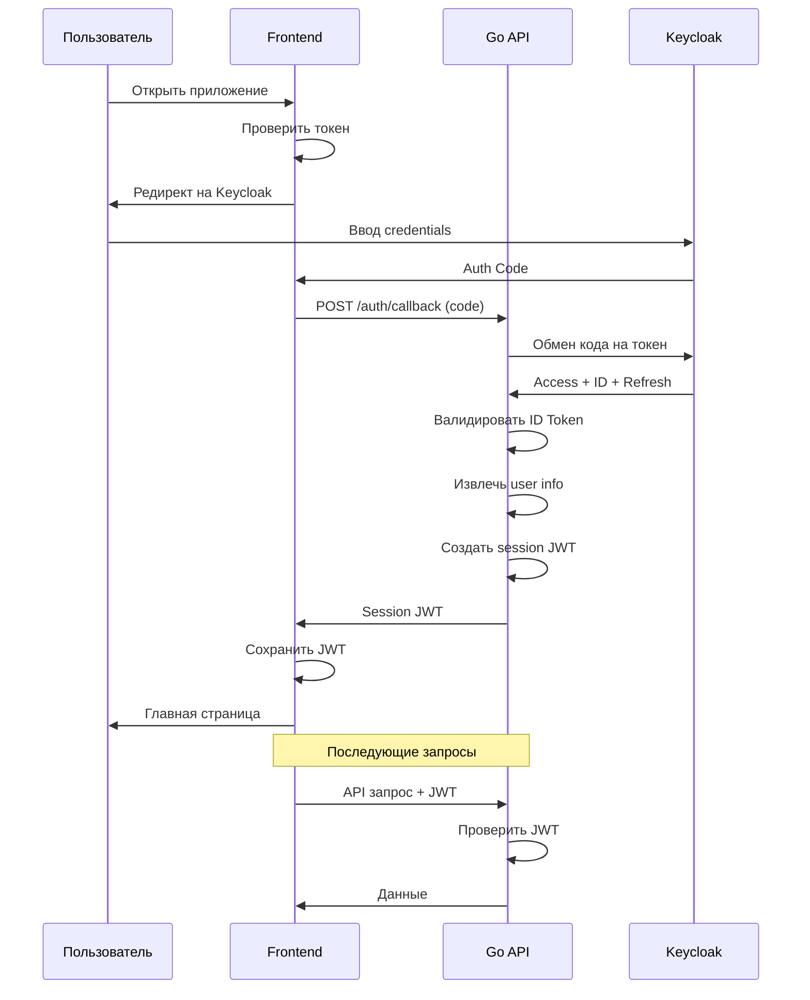
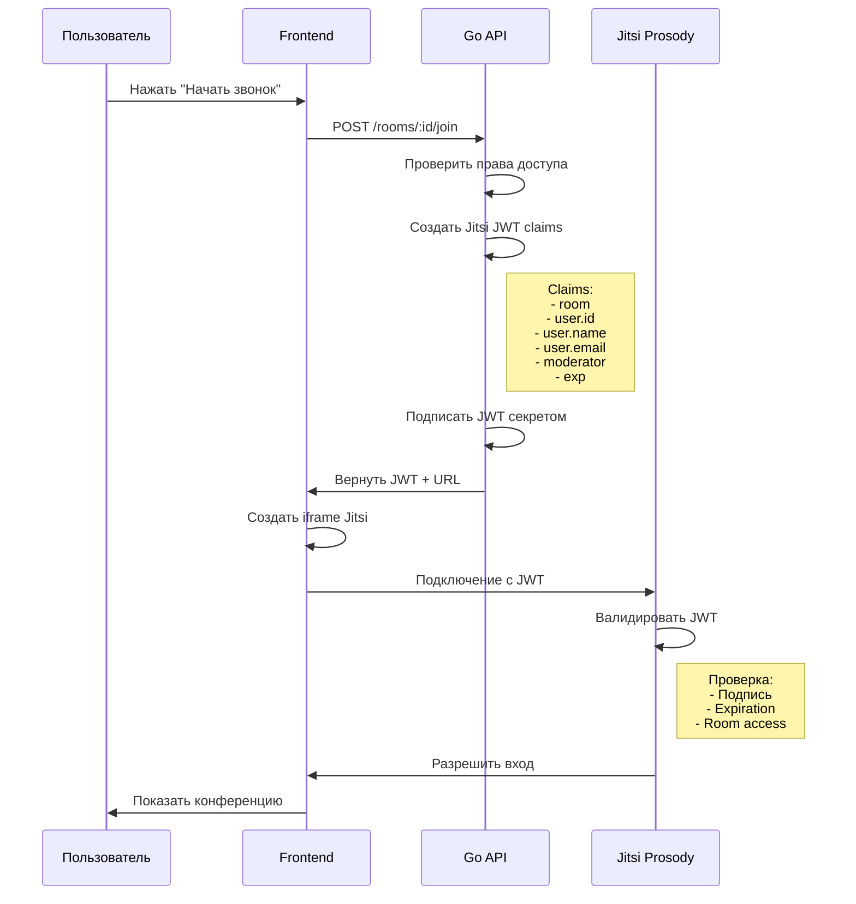

# Integration Guide

**Версия:** 1.0  
**Дата:** 24 марта 2026 г.  
**Статус:** Черновик

---

## 1. Обзор интеграций

Система интегрируется со следующими внешними сервисами:

| Сервис | Тип | Назначение | Протокол |
|--------|-----|------------|----------|
| Keycloak | SSO | Аутентификация и авторизация | OIDC/OAuth 2.0 |
| MS Exchange | Календари | Синхронизация встреч | Microsoft Graph API |
| Jitsi Meet | Видеоконференции | Встраивание звонков | JWT + iframe |
| Azure AD | Identity Provider | Корпоративные пользователи | SAML/OIDC |

---

## 2. Keycloak интеграция

### 2.1. Настройка Realm

**Шаг 1: Создание realm**

```bash
# Через kcadm.sh
./kcadm.sh config credentials --server http://keycloak:8080 \
  --realm master --user admin --password admin

./kcadm.sh create realms -s realm=company -s enabled=true
```

**Шаг 2: Настройка токенов**

```
Realm Settings → Tokens
- Access Token Lifespan: 15 минут
- Client Session Idle Timeout: 30 минут
- Client Session Max Lifespan: 8 часов
- Refresh Token Max Reuse: неограниченно
- Refresh Token Max Lifespan: 7 дней
```

### 2.2. Создание клиента для Go API

**Настройки клиента:**

```
Clients → Create
- Client ID: messenger-api
- Client Protocol: openid-connect
- Access Type: confidential
- Service Accounts Enabled: ON
- Authorization Enabled: ON
- Valid Redirect URIs: https://api.company.com/*
- Web Origins: https://api.company.com
```

**Service Account Roles:**

```
Service Account Roles → Assign Role
- realm-management: view-users
- realm-management: manage-users
```

**Credentials:**

```
Credentials → Client Secret
- Secret: xxx-xxx-xxx (сохранить для Go API)
```

### 2.3. Создание клиента для Frontend

```
Clients → Create
- Client ID: messenger-frontend
- Client Protocol: openid-connect
- Access Type: public
- Standard Flow Enabled: ON
- Direct Access Grants Enabled: OFF
- Valid Redirect URIs: https://chat.company.com/*
- Web Origins: https://chat.company.com
```

### 2.4: Маппинг атрибутов

**Protocol Mappers:**

```json
{
  "name": "user-roles",
  "protocol": "openid-connect",
  "protocolMapper": "oidc-usermodel-realm-role-mapper",
  "consentRequired": false,
  "config": {
    "multivalued": "true",
    "token.claim": "roles",
    "id.token.claim": "true",
    "access.token.claim": "true"
  }
}
```

```json
{
  "name": "user-id",
  "protocol": "openid-connect",
  "protocolMapper": "oidc-usermodel-property-mapper",
  "consentRequired": false,
  "config": {
    "user.attribute": "id",
    "token.claim": "user_id",
    "id.token.claim": "true",
    "access.token.claim": "true"
  }
}
```

### 2.5. Go код: OIDC клиент

```go
// internal/auth/keycloak.go
package auth

import (
    "context"
    "fmt"
    "net/http"
    "time"

    "github.com/coreos/go-oidc/v3/oidc"
    "golang.org/x/oauth2"
)

type KeycloakConfig struct {
    ServerURL    string
    Realm        string
    ClientID     string
    ClientSecret string
    RedirectURL  string
}

type KeycloakProvider struct {
    Provider   *oidc.Provider
    OAuth2Conf *oauth2.Config
    Verifier   *oidc.IDTokenVerifier
}

func NewKeycloakProvider(cfg KeycloakConfig) (*KeycloakProvider, error) {
    ctx := context.Background()
    
    // URL issuer: https://keycloak.company.com/realms/company
    issuerURL := fmt.Sprintf("%s/realms/%s", cfg.ServerURL, cfg.Realm)
    
    provider, err := oidc.NewProvider(ctx, issuerURL)
    if err != nil {
        return nil, fmt.Errorf("failed to create provider: %w", err)
    }
    
    oauth2Conf := &oauth2.Config{
        ClientID:     cfg.ClientID,
        ClientSecret: cfg.ClientSecret,
        RedirectURL:  cfg.RedirectURL,
        Endpoint:     provider.Endpoint(),
        Scopes:       []string{oidc.ScopeOpenID, "profile", "email", "roles"},
    }
    
    verifier := provider.Verifier(&oidc.Config{
        ClientID: cfg.ClientID,
    })
    
    return &KeycloakProvider{
        Provider:   provider,
        OAuth2Conf: oauth2Conf,
        Verifier:   verifier,
    }, nil
}

// AuthURL генерирует URL для редиректа на Keycloak
func (kp *KeycloakProvider) AuthURL(state string) string {
    return kp.OAuth2Conf.AuthCodeURL(state, 
        oauth2.AccessTypeOffline,
        oauth2.SetAuthURLParam("prompt", "login"),
    )
}

// Exchange обменивает код на токены
func (kp *KeycloakProvider) Exchange(ctx context.Context, code string) (*oauth2.Token, error) {
    return kp.OAuth2Conf.Exchange(ctx, code)
}

// VerifyToken проверяет ID токен
func (kp *KeycloakProvider) VerifyToken(ctx context.Context, rawIDToken string) (*oidc.IDToken, error) {
    return kp.Verifier.Verify(ctx, rawIDToken)
}

// RefreshToken обновляет access токен
func (kp *KeycloakProvider) RefreshToken(ctx context.Context, refreshToken string) (*oauth2.Token, error) {
    tokenSource := kp.OAuth2Conf.TokenSource(ctx, &oauth2.Token{
        RefreshToken: refreshToken,
    })
    
    return tokenSource.Token()
}

// GetUserInfo получает информацию о пользователе
func (kp *KeycloakProvider) GetUserInfo(ctx context.Context, token *oauth2.Token) (*oidc.UserInfo, error) {
    return kp.Provider.UserInfo(ctx, oauth2.StaticTokenSource(token))
}
```

### 2.6. Go код: Middleware аутентификации

```go
// internal/auth/middleware.go
package auth

import (
    "context"
    "net/http"
    "strings"
)

type contextKey string

const UserContextKey contextKey = "user"

type UserClaims struct {
    UserID       string   `json:"user_id"`
    Email        string   `json:"email"`
    Name         string   `json:"name"`
    Roles        []string `json:"roles"`
    KeycloakID   string   `json:"keycloak_id"`
}

func AuthMiddleware(kp *KeycloakProvider, next http.Handler) http.Handler {
    return http.HandlerFunc(func(w http.ResponseWriter, r *http.Request) {
        authHeader := r.Header.Get("Authorization")
        if authHeader == "" {
            http.Error(w, "missing authorization header", http.StatusUnauthorized)
            return
        }
        
        parts := strings.Split(authHeader, " ")
        if len(parts) != 2 || parts[0] != "Bearer" {
            http.Error(w, "invalid authorization format", http.StatusUnauthorized)
            return
        }
        
        tokenString := parts[1]
        
        // Проверка session JWT
        claims, err := ValidateSessionJWT(tokenString)
        if err != nil {
            http.Error(w, "invalid token", http.StatusUnauthorized)
            return
        }
        
        // Добавляем пользователя в контекст
        ctx := context.WithValue(r.Context(), UserContextKey, claims)
        next.ServeHTTP(w, r.WithContext(ctx))
    })
}

func GetUserFromContext(ctx context.Context) *UserClaims {
    user, ok := ctx.Value(UserContextKey).(*UserClaims)
    if !ok {
        return nil
    }
    return user
}

func RequireRole(requiredRole string) func(http.Handler) http.Handler {
    return func(next http.Handler) http.Handler {
        return http.HandlerFunc(func(w http.ResponseWriter, r *http.Request) {
            user := GetUserFromContext(r.Context())
            if user == nil {
                http.Error(w, "unauthorized", http.StatusUnauthorized)
                return
            }
            
            hasRole := false
            for _, role := range user.Roles {
                if role == requiredRole {
                    hasRole = true
                    break
                }
            }
            
            if !hasRole {
                http.Error(w, "forbidden", http.StatusForbidden)
                return
            }
            
            next.ServeHTTP(w, r)
        })
    }
}
```

### 2.7. Диаграмма последовательности OIDC



---

## 3. MS Exchange интеграция

### 3.1. Регистрация приложения в Azure AD

**Шаг 1: Создание регистрации**

```
Azure Portal → Azure Active Directory → App registrations → New registration
- Name: messenger-integration
- Supported account types: Accounts in this organizational directory only
- Redirect URI: https://api.company.com/api/v1/auth/exchange/callback
```

**Шаг 2: Настройка разрешений**

```
API permissions → Add a permission → Microsoft Graph → Delegated permissions:
- Calendars.ReadWrite
- Calendars.ReadWrite.Shared
- Mail.Send
- Mail.Send.Shared
- User.Read
- offline_access
```

**Шаг 3: Создание secret**

```
Certificates & secrets → New client secret
- Description: messenger-secret
- Expires: 24 месяца
- Secret: xxx (сохранить немедленно)
```

**Шаг 4: Запись параметров**

```
Overview:
- Application (client) ID: xxx-xxx-xxx
- Directory (tenant) ID: yyy-yyy-yyy
```

### 3.2. Go код: Graph API клиент

```go
// internal/exchange/graph.go
package exchange

import (
    "context"
    "fmt"
    "time"

    azidentity "github.com/Azure/azure-sdk-for-go/sdk/azidentity"
    msgraph "github.com/microsoftgraph/msgraph-sdk-go"
    "github.com/microsoftgraph/msgraph-sdk-go/models"
    "github.com/microsoftgraph/msgraph-sdk-go/users"
)

type GraphClient struct {
    client   *msgraph.GraphServiceClient
    tenantID string
}

type GraphConfig struct {
    TenantID     string
    ClientID     string
    ClientSecret string
}

func NewGraphClient(cfg GraphConfig) (*GraphClient, error) {
    cred, err := azidentity.NewClientSecretCredential(
        cfg.TenantID,
        cfg.ClientID,
        cfg.ClientSecret,
        nil,
    )
    if err != nil {
        return nil, fmt.Errorf("failed to create credential: %w", err)
    }
    
    client, err := msgraph.NewGraphServiceClientWithCredentials(
        cred,
        []string{"https://graph.microsoft.com/.default"},
    )
    if err != nil {
        return nil, fmt.Errorf("failed to create client: %w", err)
    }
    
    return &GraphClient{
        client:   client,
        tenantID: cfg.TenantID,
    }, nil
}

// EventRequest параметры для создания события
type EventRequest struct {
    Subject       string
    Body          string
    StartTime     time.Time
    EndTime       time.Time
    Location      string
    Attendees     []string
    JitsiURL      string
    OrganizerMail string
}

// CreateEvent создаёт событие в календаре
func (gc *GraphClient) CreateEvent(ctx context.Context, req EventRequest) (*models.Event, error) {
    // Создаём тело события
    body := models.NewItemBody()
    contentType := models.HTML_BODYTYPE
    body.SetContentType(&contentType)
    
    bodyContent := fmt.Sprintf("%s<br/><br/><a href='%s'>Присоединиться к встрече</a>", 
        req.Body, req.JitsiURL)
    body.SetContent(&bodyContent)
    
    // Время начала
    startTZ := models.NewDateTimeTimeZone()
    start := req.StartTime.Format("2006-01-02T15:04:05")
    startTZ.SetDateTime(&start)
    startTZ.SetTimeZone(ptr("UTC"))
    
    // Время окончания
    endTZ := models.NewDateTimeTimeZone()
    end := req.EndTime.Format("2006-01-02T15:04:05")
    endTZ.SetDateTime(&end)
    endTZ.SetTimeZone(ptr("UTC"))
    
    // Местоположение
    location := models.NewLocation()
    location.SetDisplayName(&req.Location)
    
    // Создаём событие
    event := models.NewEvent()
    event.SetSubject(&req.Subject)
    event.SetBody(body)
    event.SetStart(startTZ)
    event.SetEnd(endTZ)
    event.SetLocation(location)
    
    // Участники
    if len(req.Attendees) > 0 {
        var attendees []models.Attendeeable
        for _, email := range req.Attendees {
            attendee := models.NewAttendee()
            attendee.SetType(ptr(models.REQUIRED_ATTENDEETYPE))
            
            emailAddr := models.NewEmailAddress()
            emailAddr.SetAddress(&email)
            attendee.SetEmailAddress(emailAddr)
            
            attendees = append(attendees, attendee)
        }
        event.SetAttendees(attendees)
    }
    
    // Создаём через API
    result, err := gc.client.Me().Calendar().Events().Post(ctx, event, nil)
    if err != nil {
        return nil, fmt.Errorf("failed to create event: %w", err)
    }
    
    return result, nil
}

// GetEvents получает события календаря
func (gc *GraphClient) GetEvents(ctx context.Context, start, end time.Time) ([]models.Eventable, error) {
    queryParams := users.CalendarViewRequestBuilderGetQueryParameters{
        StartDateTime: ptr(start.Format(time.RFC3339)),
        EndDateTime:   ptr(end.Format(time.RFC3339)),
    }
    
    config := &users.CalendarViewRequestBuilderGetRequestConfiguration{
        QueryParameters: &queryParams,
    }
    
    result, err := gc.client.Me().CalendarView().Get(ctx, config)
    if err != nil {
        return nil, fmt.Errorf("failed to get events: %w", err)
    }
    
    return result.GetValue(), nil
}

// UpdateEvent обновляет событие
func (gc *GraphClient) UpdateEvent(ctx context.Context, eventID string, req EventRequest) error {
    event := models.NewEvent()
    
    subject := req.Subject
    event.SetSubject(&subject)
    
    start := req.StartTime.Format("2006-01-02T15:04:05")
    startTZ := models.NewDateTimeTimeZone()
    startTZ.SetDateTime(&start)
    startTZ.SetTimeZone(ptr("UTC"))
    event.SetStart(startTZ)
    
    end := req.EndTime.Format("2006-01-02T15:04:05")
    endTZ := models.NewDateTimeTimeZone()
    endTZ.SetDateTime(&end)
    endTZ.SetTimeZone(ptr("UTC"))
    event.SetEnd(endTZ)
    
    _, err := gc.client.Me().Calendar().EventsById(eventID).Patch(ctx, event, nil)
    if err != nil {
        return fmt.Errorf("failed to update event: %w", err)
    }
    
    return nil
}

// DeleteEvent удаляет событие
func (gc *GraphClient) DeleteEvent(ctx context.Context, eventID string) error {
    err := gc.client.Me().Calendar().EventsById(eventID).Delete(ctx, nil)
    if err != nil {
        return fmt.Errorf("failed to delete event: %w", err)
    }
    
    return nil
}

func ptr[T any](v T) *T {
    return &v
}
```

### 3.3. On-Behalf-Of flow (для доступа от имени пользователя)

```go
// internal/exchange/obo.go
package exchange

import (
    "context"
    "fmt"
    
    azidentity "github.com/Azure/azure-sdk-for-go/sdk/azidentity"
    msgraph "github.com/microsoftgraph/msgraph-sdk-go"
)

type OBOClient struct {
    client *msgraph.GraphServiceClient
}

// NewOBOClient создаёт клиент для доступа от имени пользователя
func NewOBOClient(tenantID, clientID, clientSecret, userAccessToken string) (*OBOClient, error) {
    // Создаем credential для OBO flow
    cred, err := azidentity.NewOnBehalfOfCredentialWithSecret(
        tenantID,
        clientID,
        userAccessToken,
        clientSecret,
        nil,
    )
    if err != nil {
        return nil, fmt.Errorf("failed to create OBO credential: %w", err)
    }
    
    client, err := msgraph.NewGraphServiceClientWithCredentials(
        cred,
        []string{"https://graph.microsoft.com/.default"},
    )
    if err != nil {
        return nil, fmt.Errorf("failed to create client: %w", err)
    }
    
    return &OBOClient{client: client}, nil
}
```

### 3.4. Webhook подписки на изменения календаря

```go
// internal/exchange/webhooks.go
package exchange

import (
    "context"
    "fmt"
    "time"
    
    msgraph "github.com/microsoftgraph/msgraph-sdk-go"
    "github.com/microsoftgraph/msgraph-sdk-go/models"
    "github.com/microsoftgraph/msgraph-sdk-go/subscriptions"
)

// CreateSubscription создаёт подписку на изменения
func (gc *GraphClient) CreateSubscription(ctx context.Context, webhookURL string) (*models.Subscription, error) {
    subscription := models.NewSubscription()
    
    // Ресурс для подписки
    resource := "me/events"
    subscription.SetResource(&resource)
    
    // URL для уведомлений
    subscription.SetNotificationURL(&webhookURL)
    
    // Время окончания (макс 3 дня для календарей)
    expiration := time.Now().Add(72 * time.Hour).Format(time.RFC3339)
    subscription.SetExpirationDateTime(&expiration)
    
    // Client state для валидации
    clientState := "secret-client-state"
    subscription.SetClientState(&clientState)
    
    result, err := gc.client.Subscriptions().Post(ctx, subscription, nil)
    if err != nil {
        return nil, fmt.Errorf("failed to create subscription: %w", err)
    }
    
    return result, nil
}

// RenewSubscription продлевает подписку
func (gc *GraphClient) RenewSubscription(ctx context.Context, subscriptionID string) error {
    subscription := models.NewSubscription()
    
    expiration := time.Now().Add(72 * time.Hour).Format(time.RFC3339)
    subscription.SetExpirationDateTime(&expiration)
    
    _, err := gc.client.SubscriptionsById(subscriptionID).Patch(ctx, subscription, nil)
    if err != nil {
        return fmt.Errorf("failed to renew subscription: %w", err)
    }
    
    return nil
}
```

---

## 4. Jitsi Meet интеграция

### 4.1. Настройка Prosody для JWT

**Файл конфигурации:** `/etc/prosody/conf.d/meet.company.com.cfg.lua`

```lua
VirtualHost "meet.company.com"
    authentication = "jwt"
    app_id = "jitsi"
    asap_key_file = "/etc/prosody/keys/asap.key"
    allow_empty_token = false
    
    -- Модераторы могут входить без токена (опционально)
    modules_enabled = {
        "bosh";
        "websocket";
        "muc";
    }
    
    c2s_require_encryption = true

-- Настройка MUC
Component "conference.meet.company.com" "muc"
    modules_enabled = {
        "muc_mam";
        "muc_hide_all";
    }
    
    admin = "focus@auth.meet.company.com"
    allow_anonymous = false
    
    -- Лимиты
    muc_room_locking = false
    muc_room_default_public_jids = true
    muc_max_room_name_length = 100
```

### 4.2. Генерация ASAP ключей

```bash
# Создать директорию
mkdir -p /etc/prosody/keys

# Сгенерировать приватный ключ
openssl genrsa -out /etc/prosody/keys/asap.key 2048

# Извлечь публичный ключ (для передачи клиентам)
openssl rsa -in /etc/prosody/keys/asap.key -pubout -out /etc/prosody/keys/asap.key.pub

# Установить права
chmod 640 /etc/prosody/keys/asap.key
chown prosody:prosody /etc/prosody/keys/asap.key
```

### 4.3. Go код: Генерация JWT для Jitsi

```go
// internal/jitsi/jwt.go
package jitsi

import (
    "crypto/hmac"
    "crypto/sha256"
    "encoding/base64"
    "fmt"
    "time"
    
    "github.com/golang-jwt/jwt/v5"
)

type JWTConfig struct {
    AppID     string
    AppSecret string
    Issuer    string
    Audience  string
}

type UserContext struct {
    ID        string `json:"id"`
    Name      string `json:"name"`
    Email     string `json:"email"`
    Moderator bool   `json:"moderator"`
    AvatarURL string `json:"avatar,omitempty"`
}

type JitsiClaims struct {
    Context struct {
        User UserContext `json:"user"`
    } `json:"context"`
    Room string `json:"room"`
    jwt.RegisteredClaims
}

func NewJWTConfig(appID, appSecret string) JWTConfig {
    return JWTConfig{
        AppID:     appID,
        AppSecret: appSecret,
        Issuer:    "jitsi",
        Audience:  "jitsi",
    }
}

// GenerateToken генерирует JWT для доступа к комнате Jitsi
func GenerateToken(cfg JWTConfig, roomName string, user UserContext) (string, error) {
    now := time.Now()
    exp := now.Add(8 * time.Hour) // Время жизни токена
    
    claims := JitsiClaims{}
    claims.Context.User = user
    claims.Room = roomName
    claims.RegisteredClaims = jwt.RegisteredClaims{
        Issuer:    cfg.Issuer,
        Audience:  jwt.ClaimStrings{cfg.Audience},
        ExpiresAt: jwt.NewNumericDate(exp),
        IssuedAt:  jwt.NewNumericDate(now),
        NotBefore: jwt.NewNumericDate(now),
    }
    
    token := jwt.NewWithClaims(jwt.SigningMethodHS256, claims)
    
    // Подписываем секретом
    tokenString, err := token.SignedString([]byte(cfg.AppSecret))
    if err != nil {
        return "", fmt.Errorf("failed to sign token: %w", err)
    }
    
    return tokenString, nil
}

// GenerateRoomURL создаёт полный URL для входа в комнату
func GenerateRoomURL(baseURL, roomName string, token string) string {
    return fmt.Sprintf("%s/%s?jwt=%s", baseURL, roomName, token)
}

// ValidateToken проверяет JWT токен от Jitsi (для webhook)
func ValidateToken(cfg JWTConfig, tokenString string) (*JitsiClaims, error) {
    keyFunc := func(token *jwt.Token) (interface{}, error) {
        return []byte(cfg.AppSecret), nil
    }
    
    token, err := jwt.ParseWithClaims(tokenString, &JitsiClaims{}, keyFunc)
    if err != nil {
        return nil, fmt.Errorf("failed to parse token: %w", err)
    }
    
    if !token.Valid {
        return nil, fmt.Errorf("invalid token")
    }
    
    claims, ok := token.Claims.(*JitsiClaims)
    if !ok {
        return nil, fmt.Errorf("invalid claims type")
    }
    
    return claims, nil
}

// GenerateSignature генерирует подпись для webhook
func GenerateSignature(secret, payload string) string {
    h := hmac.New(sha256.New, []byte(secret))
    h.Write([]byte(payload))
    return base64.StdEncoding.EncodeToString(h.Sum(nil))
}
```

### 4.4. Frontend: Встраивание Jitsi iframe

```typescript
// src/components/JitsiMeeting.tsx
import React, { useEffect, useRef } from 'react';

interface JitsiMeetingProps {
  roomName: string;
  jwt: string;
  userName: string;
  userEmail: string;
  onLeave?: () => void;
}

export const JitsiMeeting: React.FC<JitsiMeetingProps> = ({
  roomName,
  jwt,
  userName,
  userEmail,
  onLeave,
}) => {
  const jitsiContainerRef = useRef<HTMLDivElement>(null);
  const apiRef = useRef<any>(null);

  useEffect(() => {
    if (!jitsiContainerRef.current) return;

    // Загружаем Jitsi External API
    const script = document.createElement('script');
    script.src = 'https://meet.company.com/external_api.js';
    script.async = true;
    script.onload = () => initializeJitsi();
    document.body.appendChild(script);

    return () => {
      if (apiRef.current) {
        apiRef.current.dispose();
      }
    };
  }, []);

  const initializeJitsi = () => {
    const domain = 'meet.company.com';
    const options = {
      roomName: roomName,
      width: '100%',
      height: 600,
      parentNode: jitsiContainerRef.current,
      jwt: jwt,
      configOverwrite: {
        prejoinPageEnabled: true,
        enableWelcomePage: false,
        disableThirdPartyRequests: true,
        defaultLanguage: 'ru',
        p2p: { enabled: false },
      },
      interfaceConfigOverwrite: {
        APP_NAME: 'Corporate Messenger',
        SHOW_JITSI_WATERMARK: false,
        TOOLBAR_BUTTONS: [
          'microphone',
          'camera',
          'closedcaptions',
          'desktop',
          'fullscreen',
          'fodeviceselection',
          'hangup',
          'chat',
          'settings',
          'raisehand',
          'videoquality',
          'filmstrip',
        ],
      },
      userInfo: {
        displayName: userName,
        email: userEmail,
      },
    };

    apiRef.current = new (window as any).JitsiMeetExternalAPI(domain, options);

    // Обработчики событий
    apiRef.current.addEventListener('videoConferenceJoined', () => {
      console.log('User joined the conference');
    });

    apiRef.current.addEventListener('videoConferenceLeft', () => {
      console.log('User left the conference');
      onLeave?.();
    });

    apiRef.current.addEventListener('participantJoined', (participant: any) => {
      console.log('Participant joined:', participant);
    });

    apiRef.current.addEventListener('participantLeft', (participant: any) => {
      console.log('Participant left:', participant);
    });
  };

  return <div ref={jitsiContainerRef} style={{ height: '600px' }} />;
};
```

### 4.5. Диаграмма последовательности Jitsi JWT



---

## 5. Обработка webhook событий

### 5.1. Входящие webhook от Jitsi

```go
// internal/webhooks/jitsi.go
package webhooks

import (
    "encoding/json"
    "io"
    "net/http"
    "time"
)

type JitsiEvent struct {
    Event          string                 `json:"event"`
    ConferenceName string                 `json:"conference_name"`
    Room           string                 `json:"room"`
    Timestamp      string                 `json:"timestamp"`
    Data           map[string]interface{} `json:"data"`
}

func (h *WebhookHandler) HandleJitsiWebhook(w http.ResponseWriter, r *http.Request) {
    // Проверка подписи
    signature := r.Header.Get("X-Jitsi-Signature")
    if signature == "" {
        http.Error(w, "missing signature", http.StatusBadRequest)
        return
    }
    
    // Чтение тела
    body, err := io.ReadAll(r.Body)
    if err != nil {
        http.Error(w, "failed to read body", http.StatusInternalServerError)
        return
    }
    
    // Валидация подписи
    expectedSignature := jitsi.GenerateSignature(h.config.JitsiWebhookSecret, string(body))
    if signature != expectedSignature {
        http.Error(w, "invalid signature", http.StatusUnauthorized)
        return
    }
    
    // Парсинг события
    var event JitsiEvent
    if err := json.Unmarshal(body, &event); err != nil {
        http.Error(w, "invalid json", http.StatusBadRequest)
        return
    }
    
    // Обработка по типу события
    switch event.Event {
    case "conference.created":
        h.handleConferenceCreated(&event)
    case "conference.ended":
        h.handleConferenceEnded(&event)
    case "participant.joined":
        h.handleParticipantJoined(&event)
    case "participant.left":
        h.handleParticipantLeft(&event)
    }
    
    w.WriteHeader(http.StatusOK)
}

func (h *WebhookHandler) handleConferenceCreated(event *JitsiEvent) {
    // Логирование события
    h.logger.Info("Conference created",
        "room", event.Room,
        "timestamp", event.Timestamp,
    )
    
    // Сохранение в БД
    // Отправка уведомлений
}
```

### 5.2. Исходящие webhook (отправка событий клиентам)

```go
// internal/webhooks/dispatcher.go
package webhooks

import (
    "bytes"
    "context"
    "crypto/hmac"
    "crypto/sha256"
    "encoding/base64"
    "encoding/json"
    "fmt"
    "net/http"
    "time"
)

type WebhookEvent struct {
    Type      string                 `json:"type"`
    Timestamp time.Time              `json:"timestamp"`
    Data      map[string]interface{} `json:"data"`
}

type WebhookDelivery struct {
    WebhookID string
    URL       string
    Secret    string
    Event     WebhookEvent
}

func (d *WebhookDispatcher) Deliver(ctx context.Context, delivery WebhookDelivery) error {
    // Сериализация payload
    payload, err := json.Marshal(delivery.Event)
    if err != nil {
        return fmt.Errorf("failed to marshal payload: %w", err)
    }
    
    // Создание подписи
    signature := d.createSignature(delivery.Secret, payload, delivery.Event.Timestamp)
    
    // HTTP запрос
    req, err := http.NewRequestWithContext(ctx, "POST", delivery.URL, bytes.NewReader(payload))
    if err != nil {
        return fmt.Errorf("failed to create request: %w", err)
    }
    
    req.Header.Set("Content-Type", "application/json")
    req.Header.Set("X-Webhook-Signature", signature)
    req.Header.Set("X-Webhook-Timestamp", delivery.Event.Timestamp.Format(time.RFC3339))
    req.Header.Set("X-Webhook-ID", delivery.WebhookID)
    
    client := &http.Client{Timeout: 30 * time.Second}
    resp, err := client.Do(req)
    if err != nil {
        return fmt.Errorf("failed to deliver webhook: %w", err)
    }
    defer resp.Body.Close()
    
    if resp.StatusCode < 200 || resp.StatusCode >= 300 {
        return fmt.Errorf("webhook returned status %d", resp.StatusCode)
    }
    
    return nil
}

func (d *WebhookDispatcher) createSignature(secret string, payload []byte, timestamp time.Time) string {
    h := hmac.New(sha256.New, []byte(secret))
    h.Write([]byte(timestamp.Format(time.RFC3339)))
    h.Write([]byte("."))
    h.Write(payload)
    return base64.StdEncoding.EncodeToString(h.Sum(nil))
}
```

---

## 6. Интеграция с Azure AD (опционально)

### 6.1. Настройка SAML SSO

**Шаг 1: Создание Enterprise Application**

```
Azure AD → Enterprise Applications → New application → Non-gallery application
- Name: Keycloak
```

**Шаг 2: Настройка SAML**

```
Single Sign-on → SAML
- Identifier (Entity ID): https://keycloak.company.com/realms/company
- Reply URL (Assertion Consumer Service): https://keycloak.company.com/realms/company/broker/azuread/endpoint
- Sign on URL: https://keycloak.company.com
```

**Шаг 3: Настройка атрибутов**

```
Attributes & Claims:
- nameidentifier → user.userprincipalname
- emailaddress → user.mail
- given_name → user.givenname
- surname → user.surname
```

**Шаг 4: Keycloak Identity Provider**

```
Keycloak Admin → Identity Providers → Add provider → SAML
- Alias: azuread
- XML Config: (скачать Federation Metadata XML из Azure)
- Sync Mode: IMPORT
- Trust Email: ON
```

---

## 7. Приложения

### 7.1. Troubleshooting

**Keycloak:**
- Проверить логи: `docker logs keycloak`
- Включить debug логирование в `standalone.xml`
- Проверить время на серверах (рассинхронизация ломает JWT)

**Exchange:**
- Проверить разрешения: `Get-MgApplication`
- Проверить токены через [Graph Explorer](https://developer.microsoft.com/en-us/graph/graph-explorer)
- Проверить квоты API (Throttling)

**Jitsi:**
- Проверить JWT через [jwt.io](https://jwt.io)
- Проверить логи Prosody: `tail -f /var/log/prosody/prosody.log`
- Проверить WebSocket: `wscat -c wss://meet.company.com/colibri-ws`

### 7.2. Ссылки

- [Keycloak Documentation](https://www.keycloak.org/documentation)
- [Microsoft Graph API](https://learn.microsoft.com/en-us/graph/api/overview)
- [Jitsi Handbook](https://jitsi.github.io/handbook/)
