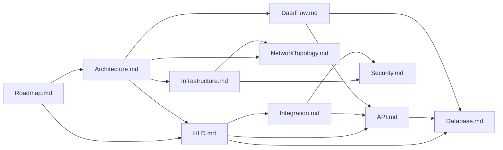

# Документация проекта: Корпоративный мессенджер на базе Jitsi Meet

**Версия:** 1.1  
**Дата последнего обновления:** 27 марта 2026 г.

---

## 📚 Содержание документации

### Основные документы

| Документ | Описание | Статус |
|----------|----------|--------|
| [Roadmap.md](./Roadmap.md) | 🗓️ План реализации по этапам с чек-листами | ✅ Готов |
| [Architecture.md](./Architecture.md) | 🏗️ Общая архитектура системы (C4 модель) | ✅ Готов |
| [HLD.md](./HLD.md) | 📐 High-Level Design — проектирование системы | ✅ Готов |
| [Infrastructure.md](./Infrastructure.md) | 🖥️ Инфраструктура и развёртывание в Kubernetes | ✅ Готов |
| [DataFlow.md](./DataFlow.md) | 💾 Диаграммы потоков данных (DFD) | ✅ Готов |
| [NetworkTopology.md](./NetworkTopology.md) | 🌐 Сетевая топология и конфигурация | ✅ Готов |
| [Security.md](./Security.md) | 🔒 Безопасность и модель угроз | ✅ Готов |
| [API.md](./API.md) | 📡 Спецификация REST API | ✅ Готов |
| [LLD.md](./LLD.md) | 🧩 Low-Level Design по backend/frontend и интеграциям | ✅ Готов |
| [Frontend.md](./Frontend.md) | 🖥️ Архитектура frontend-приложения | ✅ Готов |
| [Bots.md](./Bots.md) | 🤖 Архитектура BotEngine и команды | ✅ Готов |
| [Webhooks.md](./Webhooks.md) | 🔗 Входящие/исходящие вебхуки, безопасность, ретраи | ✅ Готов |
| [Swagger.md](./Swagger.md) | 📘 OpenAPI/Swagger, точки доступа и процесс обновления | ✅ Готов |
| [Exchange_OnPrem_EWS.md](./Exchange_OnPrem_EWS.md) | 📅 On-prem Exchange/OWA (EWS), sync worker, Kerberos | ✅ Готов |
| [Database.md](./Database.md) | 🗄️ Проектирование базы данных | ✅ Готов |
| [Integration.md](./Integration.md) | 🔌 Интеграции с внешними системами | ✅ Готов |

### Дополнительные документы (в разработке)

| Документ | Описание | Статус |
|----------|----------|--------|
| JitsiConfig.md | Детальная конфигурация Jitsi | ⏳ В плане |
| Runbook.md | Инструкции по эксплуатации | ⏳ В плане |
| Troubleshooting.md | Решение типовых проблем | ⏳ В плане |
| UserGuide.md | Руководство пользователя | ⏳ В плане |
| AdminGuide.md | Руководство администратора | ⏳ В плане |
| Glossary.md | Глоссарий терминов | ⏳ В плане |

---

## 🎯 Быстрый старт

### Для разработчиков

1. **Начать с Roadmap** — понять общий план реализации
   - [Этап 0: Инициализация проекта](./Roadmap.md#этап-0-инициализация-проекта)
   - [Этап 1: Базовая инфраструктура](./Roadmap.md#этап-1-базовая-инфраструктура)

2. **Изучить архитектуру** — понять структуру системы
   - [Architecture.md](./Architecture.md) — общая картина
   - [HLD.md](./HLD.md) — высокоуровневое проектирование

3. **Настроить окружение** — следовать инструкциям
   - [Infrastructure.md](./Infrastructure.md) — развёртывание
   - [Integration.md](./Integration.md) — настройка интеграций

4. **Начать разработку** — использовать API спецификацию
   - [API.md](./API.md) — эндпоинты и примеры
   - [Database.md](./Database.md) — схема БД

### Для DevOps

1. **Инфраструктура**
   - [Infrastructure.md](./Infrastructure.md) — Kubernetes развёртывание
   - [NetworkTopology.md](./NetworkTopology.md) — сеть и firewall

2. **Безопасность**
   - [Security.md](./Security.md) — security hardening
   - [Integration.md](./Integration.md) — настройка Keycloak, Exchange

3. **Мониторинг**
   - [Infrastructure.md](./Infrastructure.md#мониторинг) — Prometheus, Grafana
   - [NetworkTopology.md](./NetworkTopology.md#мониторинг-сети) — сетевые метрики

### Для архитекторов

1. **Общая архитектура**
   - [Architecture.md](./Architecture.md) — C4 модель, технологический стек
   - [HLD.md](./HLD.md) — архитектурные решения

2. **Потоки данных**
   - [DataFlow.md](./DataFlow.md) — DFD диаграммы
   - [Integration.md](./Integration.md) — интеграционные потоки

3. **Безопасность**
   - [Security.md](./Security.md) — модель угроз, контрмеры

---

## 📊 Диаграмма взаимосвязей документов

---

## 🔑 Ключевые решения

### Архитектурные решения

| Решение | Описание | Документ |
|---------|----------|----------|
| Go для бэкенда | Высокая производительность, простота | [HLD.md](./HLD.md#выбор-технологий) |
| React + TypeScript | Типобезопасность, экосистема | [HLD.md](./HLD.md#выбор-технологий) |
| PostgreSQL | Надёжность, JSONB, full-text search | [Database.md](./Database.md) |
| Redis | Кэш, сессии, pub/sub | [Infrastructure.md](./Infrastructure.md) |
| Kubernetes | Масштабирование, HA | [Infrastructure.md](./Infrastructure.md) |
| Keycloak | SSO через OIDC | [Integration.md](./Integration.md) |
| Jitsi Meet | Self-hosted видеоконференции | [Architecture.md](./Architecture.md) |

### Интеграционные решения

| Интеграция | Протокол | Документ |
|------------|----------|----------|
| Keycloak | OIDC/OAuth 2.0 | [Integration.md](./Integration.md#2-keycloak-интеграция) |
| MS Exchange (on-prem) | EWS SOAP | [Exchange_OnPrem_EWS.md](./Exchange_OnPrem_EWS.md) |
| Jitsi | JWT + iframe | [Integration.md](./Integration.md#jitsi-meet-интеграция) |
| Azure AD | SAML/OIDC | [Integration.md](./Integration.md#интеграция-с-azure-ad-опционально) |

---

## 📋 Чек-лист готовности документации

### Этап 0: Инициализация проекта

- [x] **Architecture.md** — Общая архитектура системы
- [x] **HLD.md** — High-Level Design
- [x] **Infrastructure.md** — Инфраструктура и развёртывание
- [x] **DataFlow.md** — Потоки данных
- [x] **NetworkTopology.md** — Сетевая топология
- [x] **Security.md** — Безопасность
- [x] **API.md** — Спецификация REST API
- [x] **Database.md** — Проектирование БД
- [x] **Integration.md** — Интеграции
- [x] **Roadmap.md** — План реализации

### Следующие приоритеты

- [x] **LLD.md** — Low-Level Design (детальное проектирование)
- [x] **Frontend.md** — Архитектура фронтенда
- [x] **Bots.md** — Детализация BotEngine и команд
- [x] **Webhooks.md** — Webhook поток, подпись, ретраи, идемпотентность
- [x] **Swagger.md** — OpenAPI и встроенный Swagger UI
- [x] **Exchange_OnPrem_EWS.md** — Exchange EWS-only, sync worker, Kerberos
- [ ] **JitsiConfig.md** — Конфигурация Jitsi
- [ ] **Runbook.md** — Инструкции по эксплуатации

---

## 📞 Контакты

| Роль | Контакт |
|------|---------|
| Технический лидер | tech-lead@company.com |
| Архитектор | architect@company.com |
| DevOps | devops@company.com |
| Security | security@company.com |

---

## 📝 История изменений документации

| Версия | Дата | Изменения |
|--------|------|-----------|
| 1.0 | 24.03.2026 | Initial release: все основные документы |

---

## 🔗 Полезные ссылки

### Внешние ресурсы

- [Jitsi Documentation](https://jitsi.github.io/handbook/)
- [Keycloak Documentation](https://www.keycloak.org/documentation)
- [Microsoft Graph API](https://learn.microsoft.com/en-us/graph/api/overview)
- [Kubernetes Documentation](https://kubernetes.io/docs/home/)
- [Go Documentation](https://go.dev/doc/)
- [React Documentation](https://react.dev/)

### Внутренние ресурсы

- [Репозиторий бэкенда](https://github.com/company/messenger-api)
- [Репозиторий фронтенда](https://github.com/company/messenger-frontend)
- [Helm charts](https://github.com/company/messenger-helm)
- [CI/CD пайплайн](https://gitlab.company.com/messenger/ci-cd)

---

## 📖 Глоссарий

| Термин | Определение |
|--------|-------------|
| SSO | Single Sign-On — единый вход |
| OIDC | OpenID Connect — протокол аутентификации |
| JWT | JSON Web Token — формат токенов |
| XMPP | Extensible Messaging and Presence Protocol |
| JVB | Jitsi Videobridge |
| HPA | Horizontal Pod Autoscaler |
| RPS | Requests Per Second |
| DFD | Data Flow Diagram |
| C4 | Context, Container, Component, Code — модель архитектуры |

Полный глоссарий см. в [Glossary.md](./Glossary.md) (в разработке).

---

**Документация поддерживается в актуальном состоянии. Последнее обновление: 24 марта 2026 г.**
