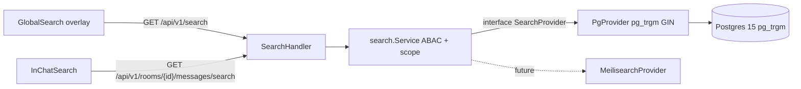

# Поиск Focus (Telegram-style)

Документ описывает архитектуру и API глобального и локального поиска
в Focus, реализованного на этапе 6 (PR-D, PR-E, PR-F).

## Архитектура



Контракт `SearchProvider` (`API_Go/internal/search/provider.go`) спроектирован
так, чтобы будущая реализация поверх Meilisearch / OpenSearch
**не требовала** изменений на фронтенде и в HTTP-handlers — достаточно
заменить провайдер.

## Backend

### Pluggable провайдер

Файлы:

- `API_Go/internal/search/provider.go` — интерфейс `SearchProvider` и
  типы `MessageHit`, `FileHit`, `MeetingHit`.
- `API_Go/internal/search/pg_provider.go` — текущая реализация (ILIKE+
  `%q%` поверх GIN-индексов на `gin_trgm_ops`).
- `API_Go/internal/search/service.go` — фасад с `Global` (errgroup
  fan-out по типам) и `LocalMessages`. Валидация `q ≥ 2 рун`.
- `API_Go/internal/search/highlight.go` — `HighlightSnippet` (HTML-escape
  + `<mark>` вокруг совпадения, ~160 символов).

### ABAC

| Тип | Видимость |
| --- | --- |
| `users` | любой авторизованный (ограничено `is_active = true`) |
| `rooms` | участвующие комнаты + публичные (`type='public'`) |
| `messages` | только в своих комнатах (`room_participants`) |
| `files` | то же, что `messages` (поиск по `metadata->>'file_name'`) |
| `meetings` | участники комнаты или `organizer_email = user.email` |

### HTTP API

Все эндпоинты требуют JWT (Authorization: Bearer ...) и проверяются
через `authMiddleware.Middleware` в `cmd/server/main.go`.

#### `GET /api/v1/search`

| Параметр | Тип | По умолчанию | Описание |
| --- | --- | --- | --- |
| `q` | string | — | Запрос (минимум 2 руны, max 200 символов) |
| `types` | csv | все | `users,rooms,messages,files,meetings` |
| `limit` | int | 20 | На каждую категорию (clamp 1..50) |

Ответ:

```json
{
  "users": [...],
  "rooms": [...],
  "messages": [
    {
      "message": { "id": "...", "content": "...", ... },
      "room_id": "...",
      "room_name": "general",
      "highlight": "...<mark>совпадение</mark>..."
    }
  ],
  "files": [
    { "message_id": "...", "room_id": "...", "file_name": "report.pdf", ... }
  ],
  "meetings": [
    { "id": "...", "subject": "Standup", "start_at": "...", ... }
  ],
  "took_ms": 12,
  "query": "..."
}
```

Параллельный fan-out через `errgroup`. Любая ошибка отдельного
провайдера обрывает остальные и возвращает `500`.

#### `GET /api/v1/rooms/{id}/messages/search`

| Параметр | Тип | По умолчанию | Описание |
| --- | --- | --- | --- |
| `q` | string | — | Запрос (≥ 2 руны) |
| `before` | uuid | — | Курсор: вернуть сообщения старше указанного `id` |
| `limit` | int | 50 | clamp 1..100 |

Ответ:

```json
{
  "messages": [ { "message": {...}, "room_id": "...", "highlight": "..." } ],
  "next_before": "<msgId>",
  "took_ms": 7,
  "query": "..."
}
```

`next_before` присутствует, когда вернулась полная страница (`len ==
limit`) — для ленивой подгрузки.

### Включение pg_trgm и GIN-индексов

Файл `API_Go/internal/database/search_indexes.go` содержит
`EnsureSearchExtensions` — идемпотентный SQL-скрипт:

```sql
CREATE EXTENSION IF NOT EXISTS pg_trgm;
CREATE INDEX IF NOT EXISTS idx_users_name_trgm
  ON users USING GIN (name gin_trgm_ops);
CREATE INDEX IF NOT EXISTS idx_users_email_trgm
  ON users USING GIN (email gin_trgm_ops);
CREATE INDEX IF NOT EXISTS idx_rooms_name_trgm
  ON rooms USING GIN (name gin_trgm_ops) WHERE deleted_at IS NULL;
CREATE INDEX IF NOT EXISTS idx_messages_content_trgm
  ON messages USING GIN (content gin_trgm_ops) WHERE is_deleted = false;
```

В `cmd/server/main.go` вызов включается флагом
`ENSURE_SEARCH_INDEXES=true` (или dev-режимом).

`permission denied` логируется как Warn — стенд без superuser-роли БД
успешно стартует, а DBA выполнит скрипт вручную:

```bash
psql "$DSN" <<'SQL'
CREATE EXTENSION IF NOT EXISTS pg_trgm;
CREATE INDEX IF NOT EXISTS idx_users_name_trgm    ON users    USING GIN (name  gin_trgm_ops);
CREATE INDEX IF NOT EXISTS idx_users_email_trgm   ON users    USING GIN (email gin_trgm_ops);
CREATE INDEX IF NOT EXISTS idx_rooms_name_trgm    ON rooms    USING GIN (name  gin_trgm_ops) WHERE deleted_at IS NULL;
CREATE INDEX IF NOT EXISTS idx_messages_content_trgm
  ON messages USING GIN (content gin_trgm_ops) WHERE is_deleted = false;
SQL
```

## Frontend

### Стор и API

- `frontend/src/store/searchStore.ts` — Zustand-стор глобального overlay.
  Любой новый `search()` отменяет предыдущий через `AbortController`,
  чтобы устаревшие ответы не перетёрли актуальные.
- `frontend/src/lib/searchClient.ts` — тонкая обёртка над `fetch`
  с поддержкой `AbortSignal`.
- `frontend/src/types/search.ts` — типы, совместимые с API_Go.

### Глобальный overlay (`GlobalSearch.tsx`)

- Открытие: `Ctrl/Cmd+K`, `/` (вне input), иконки 🔎 в `ChatHeader`
  и `RoomSidebar`.
- Закрытие: `Esc`, клик по фону, крестик.
- Группы результатов: Чаты / Люди / Сообщения / Файлы / Встречи.
- Навигация: `↑` `↓` по плоскому списку, `Enter` — переход:
  - rooms → `/rooms/:id`,
  - messages/files → `/rooms/:id?messageId=:msgId`,
  - meetings → `/rooms/:id`.
- На таргетной странице срабатывает анимация `msg--search-target`
  (`@keyframes msg-search-flash`, 1.6s).

### Локальный поиск (`InChatSearch.tsx`)

- Активируется иконкой «🔎+» в `ChatHeader` (`onLocalSearch`).
- Поле ввода + счётчик `N / total` + `↑` `↓` + `✕`.
- Хоткеи: `Enter` — следующий, `Shift+Enter` — предыдущий, `Esc` — выход.
- При навигации сообщение скроллится в видимую область (smooth) и
  получает класс `msg--search-target` на 1.6s.

### Sidebar-фильтр vs глобальный поиск

`RoomSidebar` имеет **отдельный** фильтр комнат (placeholder «Фильтр
комнат») — для локального сужения списка комнат. Иконка-лупа в верхнем
углу sidebar (`onGlobalSearch`) и в `ChatHeader` открывает именно
**глобальный** overlay, чтобы не пересекаться с этим фильтром.

## Хоткеи

| Контекст | Клавиши | Действие |
| --- | --- | --- |
| везде в мессенджере | `Ctrl+K` / `Cmd+K` | открыть глобальный поиск |
| вне input | `/` | открыть глобальный поиск |
| в overlay | `↑` `↓` | навигация по результатам |
| в overlay | `Enter` | открыть выбранный результат |
| в overlay | `Esc` | закрыть |
| в InChatSearch | `Enter` | следующее совпадение |
| в InChatSearch | `Shift+Enter` | предыдущее совпадение |
| в InChatSearch | `Esc` | закрыть |

Все хоткеи реализованы через общий хук `frontend/src/hooks/useHotkey.ts`
с фильтрацией target (input/textarea/contenteditable) и опцией
`allowInInput: true`.

## План миграции на Meilisearch (будущий PR)

1. Поднять Meilisearch в кластере (отдельный StatefulSet + PVC).
2. Реализовать `MeilisearchProvider` в `internal/search/`,
   удовлетворяющий тому же `SearchProvider` интерфейсу.
3. Задеплоить background-индексер: при `messages.create/update/delete`,
   `rooms.update`, `users.update` отправлять upsert/delete в Meilisearch
   (через outbox + cron-катчап).
4. Перевести фасад `Service` на `MeilisearchProvider` через ENV-флаг
   (`SEARCH_BACKEND=meilisearch`). При этом фронтенд и API не меняются —
   ответы `/search` и `/rooms/{id}/messages/search` имеют тот же контракт,
   а Meilisearch-`_formatted` подсветка ляжет в поле `highlight`.
5. ABAC реализуется через Meilisearch `filter` (например,
   `rooms IN room_ids_of_user`).

## Тесты

### Backend

- `API_Go/internal/search/highlight_test.go` — 6 кейсов
  (case-insensitive, escape, обрезка, отсутствие совпадения).
- `API_Go/internal/search/service_test.go` — 6 кейсов
  (валидация q, частичный scope, propagation ошибок, fan-out).
- `API_Go/internal/api/handlers/search_handler_test.go` — 8 кейсов
  (401, 400 на `q < 2`, фильтрация типов, clamp limit, передача
  before/roomID/limit в провайдер).
- `API_Go/internal/search/pg_provider_test.go` — integration
  (skip-if-no-DB как принято в проекте); ABAC users/rooms/messages/
  files/meetings, scoping по roomID, поиск по `metadata->>'file_name'`.

### Frontend (vitest, jsdom)

- `frontend/src/hooks/useHotkey.test.tsx` — 7 кейсов.
- `frontend/src/store/searchStore.test.ts` — 6 кейсов
  (отмена устаревших AbortController, error, reset).
- `frontend/src/components/GlobalSearch.test.tsx` — 6 кейсов
  (debounce → 1 запрос, группы, ↓+Enter навигация, Escape).
- `frontend/src/components/InChatSearch.test.tsx` — 7 кейсов
  (счётчик 0/0 vs N/M, prev/next хоткеи и кнопки, Escape, scrollIntoView
  + `msg--search-target`).
